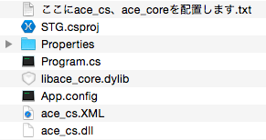
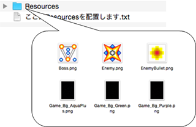

## 02. プレイヤーキャラクターを描画してみよう

### 概要

前章では、AC-Engineを利用してウインドウを表示してみました。しかし画面は真っ黒のままで、何も表示されていません。そこで本章では、画面にプレイヤーのキャラクターを表示してみましょう。

本章で使用するC#の知識は下記のWebページに記述されています。記述されている内容のうち一部分のみを使用しますので、どこを読めばいいかも併せて記述しています。

* [C# によるプログラミング入門 - クラス](http://ufcpp.net/study/csharp/oo_class.html) 

この章では、自分でクラスを定義するということは行いません。AC-Engineに用意されているクラスを使用するのみです。


### 事前準備

今回も、自分でプロジェクトの設定はせずに、設定済みのプロジェクトをダウンロードして使用します。

ただし、注意点があります。本章からは一部のファイルがプロジェクトに含まれておらず、自分で配置する必要があります。
具体的には```ace_cs.dll```、```ace_core.dll```、```ace_cs.xml```といったAC-Engineを使用するのに必要なファイルや、
画像や音といった見た目に関わるリソースファイルが含まれていません。

「ace～」の3つのファイルは、以下のリンクからダウンロードします。

[DLL(Windows)](Common/DLL.zip?raw=true)

[DLL(Mac)](Common/Mac/DLL.zip?raw=true)

画像等のファイルは、以下のリンクからダウンロードします。

[リソース](Common/Resources.zip?raw=true)

それらの圧縮ファイルをダウンロードしたら、解凍してプロジェクトに配置します。

[プロジェクト(Windows)](Projects/STG02_Start.zip?raw=true)

[プロジェクト(Mac)](Projects/Mac/STG02_Start.zip?raw=true)

```DLL.zip``` の中身は、```STG02_Start/STG/``` に配置します。

* Windowsの場合


* Macの場合


```Resources.zip```の中身は、```STG02_Start/bin/``` に配置します。この時、```STG02_Start/bin/Resources/画像等``` となるように配置されるようにします。
Windowsの標準機能で解凍した場合、Resourcesのフォルダが2重にできてしまうので注意しましょう。

* Windowsの場合


* Mac OS Xの場合


このResourcesディレクトリにはゲーム中で表示されるキャラクターの画像や攻撃が命中した時に鳴る効果音等が保存しています。
当然、この講座で表示される画像が気に入らなければ画像を差し替えて問題ありません。

全てのファイルを配置し終わったら、```STG.sln```を開きます。今回はこれを変更して、プレイヤーのキャラクターを画面に表示させてみます。

### プレイヤーの表示

それでは、プレイヤーを表示するためにMainメソッドを以下のように書き換えます。
*インスタンス*という、聞きなれない単語がコメントに記述されていますが、後で解説します。

```diff

class Program
{
	[STAThread]
	static void Main(string[] args)
	{
		// AC-Engineを初期化する。
		ace.Engine.Initialize("STG", 640, 480, new ace.EngineOption());
		
+		// プレイヤーのインスタンスを生成する。
+		ace.TextureObject2D player = new ace.TextureObject2D();
+		
+		// 画像を読み込み、プレイヤーのインスタンスに画像を設定する。
+		player.Texture = ace.Engine.Graphics.CreateTexture2D("Resources/Player.png");
+
+		// エンジンにプレイヤーのインスタンスを追加する。
+		ace.Engine.AddObject2D(player);

		
		// AC-Engineのウインドウが閉じられていないか確認する。
		while (ace.Engine.DoEvents())
		{
			// もし、Escキーが押されていたらwhileループを抜ける。
			if(ace.Engine.Keyboard.GetKeyState(ace.Keys.Escape) == ace.KeyState.Push)
			{
				break;
			}
		
			// AC-Engineを更新する。
			ace.Engine.Update();
		}
		
		// AC-Engineの終了処理をする。
		ace.Engine.Terminate();
	}
}

```

「プレイヤーのインスタンス」という、初めて聞く単語が出てきました。さらに、ace.TextureObject2Dやnewという単語も出てきました。それぞれについて、順を追って説明していきます。
AC-Engineにおいてはプログラムの中でプレイヤーや敵・弾といったゲーム中で動く物体を生成し、その物体をエンジンに追加すると、追加された物体が画面に表示されるようになっています。
その物体が「インスタンス」と呼ばれています。

さて、その物体を生成するためには、物体の設計図が必要です。ace.TextureObject2Dは、ここでいう「物体の設計図」に当たります。

また、newは「設計図から物体を生成する命令」です。

つまり、このソースコードでは、ace.TextureObject2Dという設計図からplayerという物体を生成していることになるのです。

設計図は*ace.TextureObject2D*であり、その設計図を元に作られたインスタンスは*player*です。

```
ace.TextureObject2D player = new ace.TextureObject2D();
```

ace.TextureObject2Dの中には表示される画像は設定されておらず、ace.TextureObject2Dには「画像を表示する」という機能があるだけです。そのため、外部から表示される画像を設定する必要があります。
画像を読み込むには、```ace.Engine.Graphics.CreateTexture2D``` を使用します。
今回の場合、読み込まれた画像は ```ace.TextureObject2D.Texture``` に直接設定されています。ace.TextureObject2Dのインスタンスは、設定された画像を表示します。

このソースコードでは、Resources/Player.pngから画像を読み込み、プレイヤーのインスタンスに設定しています。

```
player.Texture = ace.Engine.Graphics.CreateTexture2D("Resources/Player.png");
```

```"..."``` で囲んだ部分は文字列として扱われます。ちなみに、C#では文字列のことをstring(ストリング)と呼ばれています。

ここでは、文字列```Resources/Player.png```をメソッドの引数に指定しています。

```bin/Resources/Player.png``` には以下の画像が保存されています。


この画像を読み込んでいます。当然、このディレクトリに新しく画像を追加して文字列を追加された画像のファイル名に書き換えれば他の画像を表示できます。


最後に、インスタンスをエンジンに追加します。

```
ace.Engine.AddObject2D(player);
```

図で示すと、以下のようになります。ace.TextureObject2Dという設計図が存在し、それを元に実体を生成します。
そして、人の画像を実体に設定してエンジンに追加すると人が画面に現れます。


ちなみにC#では、この設計図は「クラス(class)」と呼ばれています。

ace.TextureObject2Dは、実際は予めAC-Engineに用意されたクラスです。
クラスについて詳しく知りたい方は、概要に記述されているリンクの先を見てください。

無事動作すると、このように表示されます。


ただ、プレイヤーは左上に配置されたままです。今度はこのプレイヤーの位置をずらしてみましょう。ソースコードを以下のように編集してください。


```diff

class Program
{
	[STAThread]
	static void Main(string[] args)
	{
		// AC-Engineを初期化する。
		ace.Engine.Initialize("STG", 640, 480, new ace.EngineOption());
		
		// プレイヤーのインスタンスを生成する。
		ace.TextureObject2D player = new ace.TextureObject2D();
		
		// 画像を読み込み、プレイヤーのインスタンスに画像を設定する。
		player.Texture = ace.Engine.Graphics.CreateTexture2D("Resources/Player.png");

		// エンジンにプレイヤーのインスタンスを追加する。
		ace.Engine.AddObject2D(player);
		
+		// プレイヤーのインスタンスの位置を変更する。
+		player.Position = new ace.Vector2DF(320, 240);

		// AC-Engineのウインドウが閉じられていないか確認する。
		while (ace.Engine.DoEvents())
		{
			// もし、Escキーが押されていたらwhileループを抜ける。
			if(ace.Engine.Keyboard.GetKeyState(ace.Keys.Escape) == ace.KeyState.Push)
			{
				break;
			}
		
			// AC-Engineを更新する。
			ace.Engine.Update();
		}
		
		// AC-Engineの終了処理をする。
		ace.Engine.Terminate();
	}
}

```

```C#
player.Position = new ace.Vector2DF(100, 200);
```

というソースコードが追加されました。ここでプレイヤーのインスタンスの場所を変更しています。

無事動作するとこのように表示されます。


最後に、本章を最後まで終わらせた時のプロジェクトをダウンロードできるようにしておきました。

[プロジェクト(Windows)](Projects/STG02.zip?raw=true)

[プロジェクト(Mac)](Projects/Mac/STG02.zip?raw=true)

### まとめ

本章では、画像の表示方法を学びキャラクターを表示してみました。次章では、このキャラクターを動かしていきます。

