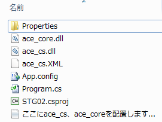

## 02. キャラクターを描画してみよう

### 概要

前章ではウインドウを表示してみました。しかし、画面は真っ黒のままで何も表示されておりません。そこで本章では画面にキャラクターを表示してみます。


### 事前準備

今回も、プロジェクトの設定は自分で変更せずに、設定済みのプロジェクトをダウンロードして、それを使用します。

ただし、注意点があります。本章からは一部のファイルがプロジェクトに含まれておらず、自分で配置する必要があります。
具体的には```ace_cs.dll```、```ace_core.dll```、```ace_cs.xml```といったACEを使用するのに必要なファイルや
画像や音といった見た目に関わるリソースファイルが含まれていません。

ace～のファイルは以下のリンクからダウンロードします。

[DLL](Common/dll.zip)

画像等のファイルは以下のリンクからダウンロードします。

[リソース](Common/Resources.zip)

それらの圧縮ファイルをダウンロードしたら、解凍してプロジェクトに配置します。

[プロジェクト](Projects/STG02.zip)

```dll.zip``` の中身は、```STG02/STG02/``` に配置します。



```Resources.zip```の中身は、```STG02/bin/``` に配置します。この時、```STG02/bin/Resources/画像等``` となるように配置されるようにします。
Windowsの標準機能で解凍した場合、Resourcesのフォルダが2重にできてしまうので注意しましょう。


全てのファイルを配置し終わったら、```STG02.sln```を開きます。```Program.cs```には前章で記述したソースコードとほぼソースコード書いてあります。
今回はこれを改造してキャラクターを表示させます。


### キャラクターの表示

それでは、キャラクターを表示するためにMainメソッドを以下のように書き換えます。


```

// aceを初期化する。
ace.Engine.Initialize("STG02", 640, 480, new ace.EngineOption());

//======== 追加するソースコード ========//

// シーンを生成する。
ace.Scene scene = new ace.Scene();

// レイヤーを生成する。
ace.Layer2D layer = new ace.Layer2D();

// シーンにレイヤーを追加する。
scene.AddLayer(layer);

// オブジェクトを生成する。
ace.TextureObject2D obj = new ace.TextureObject2D();

// レイヤーにオブジェクトを追加する。
layer.AddObject(obj);

// 画像を読み込み、オブジェクトに設定する。
obj.Texture = ace.Engine.Graphics.CreateTexture2D("Resources/Player.png");

// シーンを切り替える。
ace.Engine.ChangeScene(scene);

//======== ここまで ========//

// aceが進行可能かチェックする。
while (ace.Engine.DoEvents() && ace.Engine.Keyboard.GetKeyState(ace.Keys.Escape) != ace.KeyState.Push)
{
	// aceを更新する。
	ace.Engine.Update();
}

// aceを終了する。
ace.Engine.Terminate();

```

いきなり、シーン、レイヤー、オブジェクト、といった初めて聞く単語がでてきました。
この章は一番に覚えることが多いです。逆にここさえ乗り切れれば後は楽になるでしょう。
この、シーン、レイヤー、オブジェクトはACE特有の機能であり、キャラクター1体描画するには冗長な機能ですが、
ある程度ゲームの規模が大きくなると非常に役に立ちます。今回は、将来役に立つと思って乗り切りましょう。

これら3つはC#のクラスという機能で表現されています。ゲームを構成するパーツのようなものです。
詳しく知りたい人は、[C# によるプログラミング入門](http://ufcpp.net/study/csharp/) を読みましょう。

大まかに説明すると、

| 名称 | 内容 |
|:-----------|------------:|
| シーン | タイトル画面、ゲーム画面といった場面を表すパーツ |
| レイヤー | UI(ライフ等の表示)、前景、背景といった場面内で前後方向に分離できるパーツ |
| オブジェクト | キャラクターや敵といったゲーム中を動き回る物体 |

になっています。図で表すと


になります。

本章の場合、タイトル画面やゲーム画面といった場面の区別もなく、UIも背景も表示していないので、シーンもレイヤーも意味をなしていません。
ただ、オブジェクトを描画するためにはシーンとレイヤーが必要なので表示しています。

```
// シーンを生成する。
ace.Scene scene = new ace.Scene();
```

ここでシーンを作成しています。newはクラスの情報から実体を生成するC#の機能です。
今回は特にこのシーンにタイトル、ゲーム画面といった役割は割り当てておらず、レイヤーを描画するために存在します。

```
// レイヤーを生成する。
ace.Layer2D layer = new ace.Layer2D();

// シーンにレイヤーを追加する。
scene.AddLayer(layer);
```

ここでレイヤーを作成し、シーンに追加します。シーンに追加されたレイヤーの中にあるオブジェクトが描画されます。
シーンと同じく、特にこのレイヤーに役割を割り当てていません。今回は画像を描画するので、```ace.Layer2D``` を使用します。

```
// オブジェクトを生成する。
ace.TextureObject2D obj = new ace.TextureObject2D();

// レイヤーにオブジェクトを追加する。
layer.AddObject(obj);

// 画像を読み込み、オブジェクトに設定する。
obj.Texture = ace.Engine.Graphics.CreateTexture2D("Resources/Player.png");
```

ここでオブジェクトを作成し、レイヤーに追加しています。オブジェクトには様々な種類がありますが、
2Dの画像を描画するオブジェクトは、```ace.TextureObject2D```です。このオブジェクトに画像を設定すると、その画像が描画されます。
画像を読み込むには、```ace.Engine.Graphics.CreateTexture2D``` を使用します。読み込まれた画像は、```obj.Texture```に設定されます。

無事動作するとこのように表示されます。

```SS予定```

ただ、キャラクターは左上に配置されたままです。今度はこのキャラクターの位置をずらしましょう。

```
obj.Position = new ace.Vector2DF(100, 200);
```

というソースコードを追加します。ここでオブジェクトの場所を変更しています。

無事動作するとこのように表示されます。

```SS予定```

### まとめ

本章では、画像の表示方法を学びキャラクターを表示しました。次はこのキャラクターを動かしていきます。

