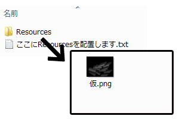

## 03. キャラクターを移動させよう

### 概要

前章ではキャラクターを表示しました。今度は、そのキャラクターをキーボードで移動させてみましょう。


### 事前準備

今回も、プロジェクトの設定は自分で変更せずに、設定済みのプロジェクトをダウンロードして、それを使用します。

[プロジェクト](Projects/STG03.zip)

[DLL](Common/dll.zip)

[リソース](Common/Resources.zip)

### キャラクターの移動


ace～のファイルは以下のリンクからダウンロードします。


画像等のファイルは以下のリンクからダウンロードします。


それらの圧縮ファイルをダウンロードしたら、解凍してプロジェクトに配置します。


```dll.zip``` の中身は、```STG02/STG02/``` に配置します。


```Resources.zip```の中身は、```STG02/bin/``` に配置します。この時、```STG02/bin/Resources/画像等``` となるように配置されるようにします。
Windowsの標準機能で解凍した場合、Resourcesのフォルダが2重にできてしまうので注意しましょう。



全てのファイルを配置し終わったら、```STG02.sln```を開きます。```Program.cs```には前章で記述したソースコードとほぼソースコード書いてあります。
今回はこれを改造してキャラクターを表示させます。


### キャラクターの表示

それでは、キャラクターを表示するためにMainメソッドを以下のように書き換えます。

```

// aceを初期化する。
ace.Engine.Initialize("STG02", 640, 480, new ace.EngineOption());

// シーンを生成する。
ace.Scene scene = new ace.Scene();

// レイヤーを生成する。
ace.Layer2D layer = new ace.Layer2D();

// シーンにレイヤーを追加する。
scene.AddLayer(layer);

// オブジェクトを生成する。
ace.TextureObject2D obj = new ace.TextureObject2D();

// レイヤーにオブジェクトを追加する。
layer.AddObject(obj);

// 画像を読み込み、オブジェクトに設定する。
obj.Texture = ace.Engine.Graphics.CreateTexture2D("Resources/Player.png");

// シーンを切り替える。
ace.Engine.ChangeScene(scene);

// aceが進行可能かチェックする。
while (ace.Engine.DoEvents() && ace.Engine.Keyboard.GetKeyState(ace.Keys.Escape) != ace.KeyState.Push)
{
	//======== 追加するソースコード ========//

	// もし、上ボタンが押されていたら、位置に(0,-1)を足す。
	if(ace.Engine.Keyboard.GetKeyState(ace.Keys.Up) == ace.KeyState.Hold)
	{
		obj.Position = obj.Position + new ace.Vector2DF(0, -1);
	}

	// もし、下ボタンが押されていたら、位置に(0,+1)を足す。
	if (ace.Engine.Keyboard.GetKeyState(ace.Keys.Down) == ace.KeyState.Hold)
	{
		obj.Position = obj.Position + new ace.Vector2DF(0, +1);
	}

	// もし、左ボタンが押されていたら、位置に(-1,0)を足す。
	if (ace.Engine.Keyboard.GetKeyState(ace.Keys.Left) == ace.KeyState.Hold)
	{
		obj.Position = obj.Position + new ace.Vector2DF(-1, 0);
	}

	// もし、左ボタンが押されていたら、位置に(+1,0)を足す。
	if (ace.Engine.Keyboard.GetKeyState(ace.Keys.Right) == ace.KeyState.Hold)
	{
		obj.Position = obj.Position + new ace.Vector2DF(+1, 0);
	}

	//======== ここまで ========//

	// aceを更新する。
	ace.Engine.Update();
}

// aceを終了する。
ace.Engine.Terminate();

```

オブジェクトを移動させるソースコードを追加しました。

```
if(ace.Engine.Keyboard.GetKeyState(ace.Keys.Up) == ace.KeyState.Hold)
```

↑キーが押されているかどうかを取得して、それが押されているかを判断します。もし押されていたらオブジェクトを移動させます。

```
{
	obj.Position = obj.Position + new ace.Vector2DF(0, -1);
}
```

オブジェクトの位置を、オブジェクトの位置+(0,-1)に変更します。ようは、オブジェクトを(0,-1)方向に移動します。

↓←→キーでも同じような処理を追加します。

無事動作するとこのように表示されます。

```SS予定 ```

### 継承を使用してコードを整理する

キャラクターを移動させるソースコードをwhileの中に追加したため、whileの中が長くなってしまいました。
現在はまだキャラクターの移動だけですが、これから敵の移動や弾を加えていくと、どんどん長くなってしまいます。しまいには開発者本人も読めなくなってしまいます。
そこで、継承というC#の機能を使用して、ソースコードを整理していきます。

早速、以下のソースコードを追加しましょう。ただし、今回追加する先はMainでなく、namespace と class の間になります。

```
namespace STG02
{
// ここに追加する
	class Program
	{
```

追加されるソースコードは以下のとおりです。

```
class Player : ace.TextureObject2D
{
	protected override void OnUpdate()
	{
		// もし、上ボタンが押されていたら、位置に(0,-1)を足す。
		if (ace.Engine.Keyboard.GetKeyState(ace.Keys.Up) == ace.KeyState.Hold)
		{
			Position = Position + new ace.Vector2DF(0, -1);
		}

		// もし、下ボタンが押されていたら、位置に(0,+1)を足す。
		if (ace.Engine.Keyboard.GetKeyState(ace.Keys.Down) == ace.KeyState.Hold)
		{
			Position = Position + new ace.Vector2DF(0, +1);
		}

		// もし、左ボタンが押されていたら、位置に(-1,0)を足す。
		if (ace.Engine.Keyboard.GetKeyState(ace.Keys.Left) == ace.KeyState.Hold)
		{
			Position = Position + new ace.Vector2DF(-1, 0);
		}

		// もし、左ボタンが押されていたら、位置に(+1,0)を足す。
		if (ace.Engine.Keyboard.GetKeyState(ace.Keys.Right) == ace.KeyState.Hold)
		{
			Position = Position + new ace.Vector2DF(+1, 0);
		}
	}
}
```

また、Mainから、オブジェクトを移動させるソースコードを消します。そうするとwhileの中は``` ace.Engine.Update(); ``` だけになります。

最後に、

```
ace.TextureObject2D obj = new ace.TextureObject2D();
```

を

```
Player obj = new Player();
```

に書き換えます。

いきなり沢山変わってよくわからないですね！しかも、実行しても見た目は変わりません。ただ、whileの中が短くなりました。それでは説明していきます。

最初に、オブジェクトの種類は沢山あると述べました。当然、開発者もC#の継承という機能を使用して、オブジェクトの種類を増やせます。

```
class Player : ace.TextureObject2D
```

それがこのソースコードになります。``` TextureObject2D ``` を元に、新しく```Player ``` というオブジェクトの種類を増やしています。
そのオブジェクトの動作はclassより下のソースコードに記述されています。

```
protected override void OnUpdate()
{
	// 省略
}
```

ここにACEが更新された時(ace.Engine.Updateが実行された時)に実行されるメソッドが記述されています。
今回はACEが更新される度にオブジェクト自身を移動させています。

overrideは継承を使用してメソッドの動作を書き換えるC#の機能です。詳しくは他のサイトを参考にしてください。OnUpdateと記述するだけでなく、overrideも記述しないと正しく動作しません。


### まとめ

本章では、キャラクターを移動させました。次はこのキャラクターから弾を発射させます。

