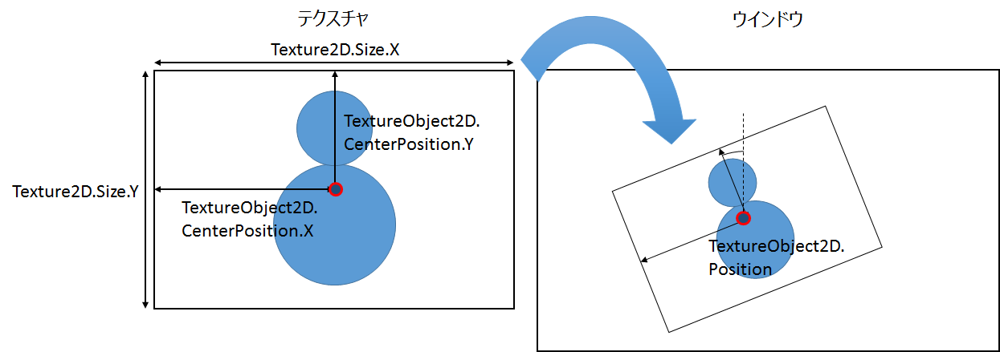

## 03. プレイヤーキャラクターを移動させよう

### 概要

前章ではプレイヤーキャラクターを表示しました。本章では、そのプレイヤーキャラクターをキーボードで移動させてみましょう。

本章では特に新しいC#の知識は必要ありません。ここまでで学習した内容を活用していきます。


### 事前準備

今回も、自分でプロジェクトの設定はせずに、設定済みのプロジェクトをダウンロードして使用します。

[プロジェクト(Windows)](Projects/STG02.zip?raw=true)

[プロジェクト(Mac)](Projects/STG02_Mac.zip?raw=true)

[DLL(Windows)](Common/DLL.zip?raw=true)

[DLL(Mac)](Common/Mac/DLL.zip?raw=true)

[リソース](Common/Resources.zip?raw=true)


### プレイヤーの移動

それでは、プレイヤーを移動させるために、Mainメソッドを以下のように書き換えます。

```diff

class Program
{
	[STAThread]
	static void Main(string[] args)
	{
		// Altseedを初期化する。
		ace.Engine.Initialize("STG", 640, 480, new ace.EngineOption());

		// プレイヤーのインスタンスを生成する。
		ace.TextureObject2D player = new ace.TextureObject2D();
		
		// 画像を読み込み、プレイヤーのインスタンスに画像を設定する。
		player.Texture = ace.Engine.Graphics.CreateTexture2D("Resources/Player.png");

		// エンジンにプレイヤーのインスタンスを追加する。
		ace.Engine.AddObject2D(player);

		// プレイヤーのインスタンスの位置を変更する。
		player.Position = new ace.Vector2DF(320, 240);

		// Altseedのウインドウが閉じられていないか確認する。
		while (ace.Engine.DoEvents())
		{
			// もし、Escキーが押されていたらwhileループを抜ける。
			if (ace.Engine.Keyboard.GetKeyState(ace.Keys.Escape) == ace.KeyState.Push)
			{
				break;
			}

+			// もし、上ボタンが押されていたら、位置に(0,-1)を足す。
+			if(ace.Engine.Keyboard.GetKeyState(ace.Keys.Up) == ace.KeyState.Hold)
+			{
+				player.Position = player.Position + new ace.Vector2DF(0, -1);
+			}

			// Altseedを更新する。
			ace.Engine.Update();
		}

		// Altseedの終了処理をする。
		ace.Engine.Terminate();
	}
}

```

プレイヤーを移動させるソースコードを追加しました。

```C#
if(ace.Engine.Keyboard.GetKeyState(ace.Keys.Up) == ace.KeyState.Hold)
```

↑キーが押されているかどうかを取得して、押されているかどうかを判断します。もしキーが押されていたら、プレイヤーを移動させます。

```C#
player.Position = player.Position + new ace.Vector2DF(0, -1);
```

プレイヤーの位置を、プレイヤーの位置+(0,-1)に変更します。要は、プレイヤーを(0,-1)方向（画面上では、上方向）に移動します。

このソースコードのままだと上方向にしか進めませんが、↓←→キーも同じようなソースコードを追加することで上下左右に移動できるようになります。
是非、自分で追加してみてください。

無事動作するとこのように表示されます。

```SS予定 ```

### プレイヤーの移動範囲を画面内に制限する

現状のソースコードでは、ずっと同じ方向に移動しているとプレイヤーが画面の外に出てしまいます。
そこで、プレイヤーが画面の外に出ないようにするためにソースコードを追加します。
さらに、`CenterPosition`という`ace.TextureObject2D`の機能も使ってみます。

```diff

class Program
{
	[STAThread]
	static void Main(string[] args)
	{
		// Altseedを初期化する。
		ace.Engine.Initialize("STG", 640, 480, new ace.EngineOption());

		// プレイヤーのインスタンスを生成する。
		ace.TextureObject2D player = new ace.TextureObject2D();
		
		// 画像を読み込み、プレイヤーのインスタンスに画像を設定する。
		player.Texture = ace.Engine.Graphics.CreateTexture2D("Resources/Player.png");

+		// プレイヤーのインスタンスに画像の中心位置を設定する。
+		player.CenterPosition = new ace.Vector2DF(player.Texture.Size.X / 2.0f, player.Texture.Size.Y / 2.0f);

		// エンジンにプレイヤーのインスタンスを追加する。
		ace.Engine.AddObject2D(player);

		// プレイヤーのインスタンスの位置を変更する。
		player.Position = new ace.Vector2DF(320, 240);

		// Altseedのウインドウが閉じられていないか確認する。
		while (ace.Engine.DoEvents())
		{
			// もし、Escキーが押されていたらwhileループを抜ける。
			if (ace.Engine.Keyboard.GetKeyState(ace.Keys.Escape) == ace.KeyState.Push)
			{
				break;
			}

			// もし、上ボタンが押されていたら、位置に(0,-1)を足す。
			if(ace.Engine.Keyboard.GetKeyState(ace.Keys.Up) == ace.KeyState.Hold)
			{
				player.Position = player.Position + new ace.Vector2DF(0, -1);
			}

			// もし、下ボタンが押されていたら、位置に(0,+1)を足す。
			if (ace.Engine.Keyboard.GetKeyState(ace.Keys.Down) == ace.KeyState.Hold)
			{
				player.Position = player.Position + new ace.Vector2DF(0, +1);
			}

			// もし、左ボタンが押されていたら、位置に(-1,0)を足す。
			if (ace.Engine.Keyboard.GetKeyState(ace.Keys.Left) == ace.KeyState.Hold)
			{
				player.Position = player.Position + new ace.Vector2DF(-1, 0);
			}

			// もし、左ボタンが押されていたら、位置に(+1,0)を足す。
			if (ace.Engine.Keyboard.GetKeyState(ace.Keys.Right) == ace.KeyState.Hold)
			{
				player.Position = player.Position + new ace.Vector2DF(+1, 0);
			}

+			// プレイヤーの位置を取得する。
+			ace.Vector2DF position = player.Position;
+		
+			// プレイヤーの位置を、(テクスチャの大きさ/2)～(ウインドウの大きさ-テクスチャの大きさ/2)の範囲に制限する。
+			position.X = ace.MathHelper.Clamp(position.X, ace.Engine.WindowSize.X - player.Texture.Size.X / 2.0f, player.Texture.Size.X / 2.0f);
+			position.Y = ace.MathHelper.Clamp(position.Y, ace.Engine.WindowSize.Y - player.Texture.Size.Y / 2.0f, player.Texture.Size.Y / 2.0f);
+		
+			// プレイヤーの位置を設定する。
+			player.Position = position;

			// Altseedを更新する。
			ace.Engine.Update();
		}

		// Altseedの終了処理をする。
		ace.Engine.Terminate();
	}
}

```

`CenterPosition`という`ace.TextureObject2D`の設定が出てきました。
これは、インスタンスの位置に対してどこに画像を描画するか、という設定です。

`CenterPosition`をわかりやすく説明するために、`ace.TextureObject2D`の設定の関係性を図示しました。
`CenterPosition`はテクスチャの左上を基準に指定します。テクスチャを描画する際、`CenterPosition`の座標が`TextureObject2D`の`Position`に一致するように描画します。
今回は、`CenterPosition`にテクスチャの大きさの半分の値を指定しています。こうすることで、テクスチャの中心が`TextureObject2D`の`Position`の位置になります。



ソースコード上では、最初に現在のインスタンスの位置を取得しています。

そして、その位置を```ace.MathHelper.Clamp ``` というメソッドで一定の範囲の値に収まるようにします。
```ace.MathHelper.Clamp(現在の値,最大値,最小値) ```と指定すると、現在の値が最大値を超えていた場合は最大値、現在の値が最小値を下回っていたら最小値、そうでなかったら現在の値をそのまま返します。
今回の場合は、最大値にはウインドウの大きさ ```ace.Engine.WindowSize.X ``` からプレイヤーのインスタンスに設定されている画像の大きさ ```player.Texture.Size.X ``` の半分を引いた値を指定し、
最小値には画像の大きさの半分を指定しています。これで、画像が画面外にはみ出さないようになります。

最後に、変更された位置をプレイヤーキャラクターに設定しています。

無事、画面の外にプレイヤーキャラクターが出なくなったら成功です。

最後に、本章を最後まで終わらせたときのプロジェクトをダウンロードできるようにしておきました。

[プロジェクト(Windows)](Projects/STG03.zip?raw=true)

[プロジェクト(Mac)](Projects/Mac/STG03.zip?raw=true)

### まとめ

本章では、プレイヤーキャラクターを移動させました。次章では、このプレイヤーキャラクターから弾を発射させてみます。
