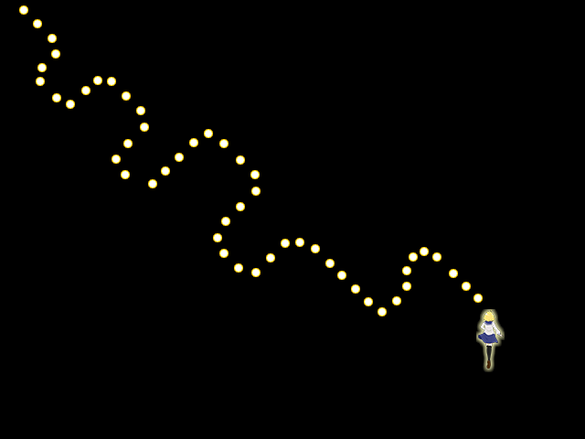

## 04. 弾を撃ってみよう

### 概要

前章ではプレイヤーキャラクターを移動させました。今度は、Zキーを押すとプレイヤーキャラクターが弾を撃つようにしましょう。

本章で使用するC#の知識は下記のサイトに記述されていますが、記述されている内容全てを使うわけではなく一部分だけなので、どこを読めばいいかも記述しています。

* [C# によるプログラミング入門 - 反復処理](http://ufcpp.net/study/csharp/st_loop.html) 

for

* [C# によるプログラミング入門 - コレクション](http://ufcpp.net/study/csharp/st_loop.html) 

List<T>


### 事前準備

今回も、自分でプロジェクトの設定せずに、設定済みのプロジェクトをダウンロードして、それを使用します。

[プロジェクト](Projects/STG03.zip)

[DLL](Common/dll.zip)

[リソース](Common/Resources.zip)


### 弾の生成

それでは、Zキーを押したら弾が生成されるように、以下のソースコードを追加します。

```diff

class Program
{
	[STAThread]
	static void Main(string[] args)
	{
		// ACEを初期化する。
		ace.Engine.Initialize("STG", 640, 480, new ace.EngineOption());

		// プレイヤーオブジェクトを生成する。
		ace.TextureObject2D player = new ace.TextureObject2D();
		
		// エンジンにプレイヤーオブジェクトを追加する。
		ace.Engine.AddObject2D(player);
		
		// 画像を読み込み、プレイヤーオブジェクトに画像を設定する。
		player.Texture = ace.Engine.Graphics.CreateTexture2D("Resources/Player.png");

+		// プレイヤーの画像の中心を設定する。
+		player.CenterPosition = new ace.Vector2DF(player.Texture.Size.X / 2.0f, player.Texture.Size.Y / 2.0f);

		// プレイヤーの位置を変更する。
		player.Position = new ace.Vector2DF(320, 240);

		// ACEのウインドウが閉じられていないか確認する。
		while (ace.Engine.DoEvents())
		{
			// もし、Escキーが押されていたらwhileループを抜ける。
			if (ace.Engine.Keyboard.GetKeyState(ace.Keys.Escape) == ace.KeyState.Push)
			{
				break;
			}

			// もし、上ボタンが押されていたら、位置に(0,-1)を足す。
			if(ace.Engine.Keyboard.GetKeyState(ace.Keys.Up) == ace.KeyState.Hold)
			{
				player.Position = player.Position + new ace.Vector2DF(0, -1);
			}

			// もし、下ボタンが押されていたら、位置に(0,+1)を足す。
			if (ace.Engine.Keyboard.GetKeyState(ace.Keys.Down) == ace.KeyState.Hold)
			{
				player.Position = player.Position + new ace.Vector2DF(0, +1);
			}

			// もし、左ボタンが押されていたら、位置に(-1,0)を足す。
			if (ace.Engine.Keyboard.GetKeyState(ace.Keys.Left) == ace.KeyState.Hold)
			{
				player.Position = player.Position + new ace.Vector2DF(-1, 0);
			}

			// もし、左ボタンが押されていたら、位置に(+1,0)を足す。
			if (ace.Engine.Keyboard.GetKeyState(ace.Keys.Right) == ace.KeyState.Hold)
			{
				player.Position = player.Position + new ace.Vector2DF(+1, 0);
			}

+			// もし、Zキーを押したら{}内の処理を行う。
+			if(ace.Engine.Keyboard.GetKeyState(ace.Keys.Z) == ace.KeyState.Push)
+			{
+				// 弾を生成する。
+				ace.TextureObject2D bullet = new ace.TextureObject2D();
+			
+				// 弾のテクスチャを読み込む。
+				bullet.Texture = ace.Engine.Graphics.CreateTexture2D("Resources/PlayerBullet.png");
+				
+				// 弾の位置を設定する。
+				bullet.Position = player.Position + new ace.Vector2DF(0, -30);
+				
+				bullet.CenterPosition = new ace.Vector2DF(bullet.Texture.Size.X / 2.0f, bullet.Texture.Size.Y / 2.0f);			
+
+				// 弾をエンジンに追加する。
+				ace.Engine.AddObject2D(bullet);
+			}

			// プレイヤーの位置を取得する。
			ace.Vector2DF position = player.Position;
		
			// プレイヤーの位置を、(テクスチャの大きさ/2)～(ウインドウの大きさ-テクスチャの大きさ/2)の範囲に制限する。
			position.X = ace.MathHelper.Clamp(position.X, ace.Engine.WindowSize.X - player.Texture.Size.X / 2.0f, player.Texture.Size.X / 2.0f);
			position.Y = ace.MathHelper.Clamp(position.Y, ace.Engine.WindowSize.Y - player.Texture.Size.Y / 2.0f, player.Texture.Size.Y / 2.0f);
		
			// プレイヤーの位置を設定する。
			player.Position = position;

			// aceを更新する。
			ace.Engine.Update();
		}

		// ACEの終了処理をする。
		ace.Engine.Terminate();
	}
}

```

もしZキーを押したら、```ace.TextureObject2D ``` のオブジェクトを新たに生成します。
そして弾の画像を読み込んで、オブジェクトに設定し、キャラクターの前に弾が配置されるように座標を設定しています。

これを実行すると、弾は出現しますが止まっています。



当然ですが、弾を移動させるソースコードを記述していないため、弾は動きません。

弾を動かすために、ListというC#に予め用意されているクラスを使用します。
Listは、任意の他のオブジェクトを好きなだけ格納したり、取り出したりできます。
Listの中に、生成された弾を入れて、毎回ACEを更新するごとに、Listの中にある弾の座標を動かしていきます。

**なお、C#ではクラスを元に生成されたオブジェクトのことをインスタンスと呼びます。以後、インスタンスと表記します。**

それでは弾を動かせるようにソースコードを追加していきます。

```diff
class Program
{
	[STAThread]
	static void Main(string[] args)
	{
		// ACEを初期化する。
		ace.Engine.Initialize("STG", 640, 480, new ace.EngineOption());

		// プレイヤーオブジェクトを生成する。
		ace.TextureObject2D player = new ace.TextureObject2D();
		
		// エンジンにプレイヤーオブジェクトを追加する。
		ace.Engine.AddObject2D(player);
		
		// 画像を読み込み、プレイヤーオブジェクトに画像を設定する。
		player.Texture = ace.Engine.Graphics.CreateTexture2D("Resources/Player.png");

		// プレイヤーの画像の中心を設定する。
		player.CenterPosition = new ace.Vector2DF(player.Texture.Size.X / 2.0f, player.Texture.Size.Y / 2.0f);

		// プレイヤーの位置を変更する。
		player.Position = new ace.Vector2DF(320, 240);

+		// リストを生成する。
+		List<ace.TextureObject2D> bullets = new List<ace.TextureObject2D>();

		// ACEのウインドウが閉じられていないか確認する。
		while (ace.Engine.DoEvents())
		{
			// もし、Escキーが押されていたらwhileループを抜ける。
			if (ace.Engine.Keyboard.GetKeyState(ace.Keys.Escape) == ace.KeyState.Push)
			{
				break;
			}

			// もし、上ボタンが押されていたら、位置に(0,-1)を足す。
			if(ace.Engine.Keyboard.GetKeyState(ace.Keys.Up) == ace.KeyState.Hold)
			{
				player.Position = player.Position + new ace.Vector2DF(0, -1);
			}

			// もし、下ボタンが押されていたら、位置に(0,+1)を足す。
			if (ace.Engine.Keyboard.GetKeyState(ace.Keys.Down) == ace.KeyState.Hold)
			{
				player.Position = player.Position + new ace.Vector2DF(0, +1);
			}

			// もし、左ボタンが押されていたら、位置に(-1,0)を足す。
			if (ace.Engine.Keyboard.GetKeyState(ace.Keys.Left) == ace.KeyState.Hold)
			{
				player.Position = player.Position + new ace.Vector2DF(-1, 0);
			}

			// もし、左ボタンが押されていたら、位置に(+1,0)を足す。
			if (ace.Engine.Keyboard.GetKeyState(ace.Keys.Right) == ace.KeyState.Hold)
			{
				player.Position = player.Position + new ace.Vector2DF(+1, 0);
			}

			// もし、Zキーを押したら{}内の処理を行う。
			if(ace.Engine.Keyboard.GetKeyState(ace.Keys.Z) == ace.KeyState.Push)
			{
				// 弾を生成する。
				ace.TextureObject2D bullet = new ace.TextureObject2D();
			
				// 弾のテクスチャを読み込む。
				bullet.Texture = ace.Engine.Graphics.CreateTexture2D("Resources/PlayerBullet.png");
				
				// 弾の位置を設定する。
				bullet.Position = player.Position + new ace.Vector2DF(0, -30);
				
				bullet.CenterPosition = new ace.Vector2DF(bullet.Texture.Size.X / 2.0f, bullet.Texture.Size.Y / 2.0f);			

				// 弾をエンジンに追加する。
				ace.Engine.AddObject2D(bullet);

+				// 弾をリストに追加する。
+				bullets.Add(bullet);
			}

+			// bulletsに格納されている弾を移動させる
+			for (int i = 0; i < bullets.Count; i++)
+			{
+				// 弾の座標を変更する
+				bullets[i].Position = bullets[i].Position + new ace.Vector2DF(0, -2);
+			}

			// プレイヤーの位置を取得する。
			ace.Vector2DF position = player.Position;
		
			// プレイヤーの位置を、(テクスチャの大きさ/2)～(ウインドウの大きさ-テクスチャの大きさ/2)の範囲に制限する。
			position.X = ace.MathHelper.Clamp(position.X, ace.Engine.WindowSize.X - player.Texture.Size.X / 2.0f, player.Texture.Size.X / 2.0f);
			position.Y = ace.MathHelper.Clamp(position.Y, ace.Engine.WindowSize.Y - player.Texture.Size.Y / 2.0f, player.Texture.Size.Y / 2.0f);
		
			// プレイヤーの位置を設定する。
			player.Position = position;

			// aceを更新する。
			ace.Engine.Update();
		}

		// ACEの終了処理をする。
		ace.Engine.Terminate();
	}
}

```

まず、Listのインスタンスを生成するためのソースコードを追加しましょう。

```C#
// リストを生成する。
List<ace.TextureObject2D> bullets = new List<ace.TextureObject2D>();
```

これでシーンを切り替えた直後にListのインスタンス、```bullets``` が生成されました。
Listの隣に<ace.TextureObject2D>と書いてありますが、これはace.TextureObject2Dを格納するListという意味です。

次に、Listのインスタンス ```bullets``` に弾のインスタンスを追加するソースコードを追加しましょう。

```
// 弾をリストに追加する。
bullets.Add(bullet);

```

```bullets.Add(bullet);``` とすると、bulletsにbulletが格納されます。

最後に、格納されている弾を動かすソースコードを追加しましょう。

```

// bulletsに格納されている弾を移動させる
for (int i = 0; i < bullets.Count; i++)
{
	// 弾の座標を変更する
	bullets[i].Position = bullets[i].Position + new ace.Vector2DF(0, -2);
}

```

forはwhileを少し複雑にしたような機能です。```for(初期化式; 条件式; 更新式)``` というように3つの式を記述できます。
まず、初期化式が実行されます。その後に、条件式を確認し、条件式が返した値がtrueの場合、``` {} ``` の中身が実行されます。実行された後に更新式が実行されます。
また、条件式を確認し、条件式が返した値がtrueの場合、``` {} ``` の中身が実行されます。実行された後に・・・と繰り返されます。

今回の場合は、iが0から、bulletsに格納されているオブジェクトの個数を表す```bullets.Count```の値-1まで、変化されつつ{}の中身が実行されます。

```bullets[i] ``` はbulletsに格納されているインスタンスの中で、i番目のインスタンスを表しています。ここではi番目のインスタンスの座標を変更しています。

この座標を変更する処理を、0からbullets.Count-1番目のインスタンスに対して実行しています。

このあたりの話は難しいので、色々ソースコードを自分で改造してみて理解することをおすすめします。

forではなくforeachという機能でもこの繰り返しを書くことが可能です。
for, foreachに関して詳しく知りたい方は概要に記述されているリンクの先を見てください。


無事動作すると動く弾を出せるようになります。

最後に、本章を最後まで終わらせた時のプロジェクトをダウンロードできるようにしておきました。

[プロジェクト](Projects/STG04.zip)

### まとめ

本章では、キャラクターが弾を撃つようになりました！ただ、ソースコードがどんどん長くなってわかりにくくなってきます。そこで次章ではソースコードをC#の機能を使って整理していきます。

また、現在の弾は画面外にでても消えずに残っているため、弾を撃ちすぎるとどんどん処理が増えてアプリケーションが重くなってしまいます。
ソースコードを整理した後に画面外に出た弾を消す処理も加えます。