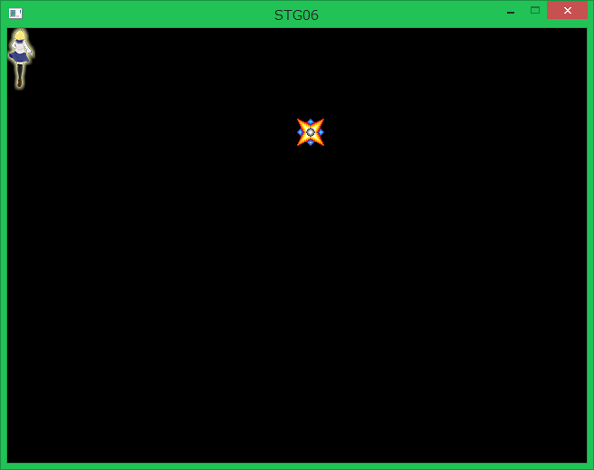

## 06. 敵の表示

### 概要

前回までの内容で、STGにおいて最低の要件を満たす自機を実装したと思います。それではこれに加えてゲームの構成には欠かせない敵キャラクターを作っていきましょう。

### 新しいソースコードの追加

これまでのプログラムを記述していた```Program.cs```は行数が多くなってきたため、見通しが悪くなってきましたね。そこで、新しい.csファイルを追加してソースコードの内容を切り分けましょう。

まずは、以下に示すようにソリューションエクスプローラーの「STG」プロジェクトの上で右クリックして、「追加」→「新しい項目(W)」を選択します。


すると、以下に示す「新しい項目の追加 - STG」の画面が表示されるので、「クラス Visual C# アイテム」を選択した状態で「名前」のところに```Enemy.cs```と打ち込んで「追加(A)」をクリックしてください。すると```Enemy.cs```が実際に作成されて、編集できるようになります。


### 敵クラスの設計と実装

まずは、敵の動きとか特徴を定義するクラス```Enemy```を作成します。先ほど追加した```Enemy.cs```に以下のように書いてください。

```C#
using System;
using System.Collections.Generic;
using System.Linq;
using System.Text;
using System.Threading.Tasks;

namespace STG
{
    public class Enemy : ace.TextureObject2D
    {
        //コンストラクタ(敵の初期位置を引数として受け取る。)
        public Enemy(ace.Vector2DF pos)
            : base()
        {
            //初期位置を設定する。
            Position = pos;

            //敵のテクスチャに使用する画像を読み込んで、設定する。
            Texture = ace.Engine.Graphics.CreateTexture2D("Resources/Enemy.png");
        }
    }
}
```

以前に作成した```Player```クラスと同様の要領でACEのTextureObject2Dクラスを継承することによってEnemyクラスを定義します。```Player```クラスと異なるのはコンストラクタを通じてその位置を設定できることです。
また、敵クラスはそれ専用の画像(Resource/Enemy.png)をテクスチャに使用します。

### 敵の表示
では、この敵をゲーム上で表示できるようにしましょう。オブジェクトをゲーム中に登場させるには以前までに説明したとおり、シーンに登録されたいずれかのレイヤーに追加する必要があります。

前回までに書いた```Program.cs```の```Main```関数を以下のように書き換えることで、```Enemy```クラスのオブジェクトをレイヤーに追加します。

```C#
～省略～

// 自機オブジェクトを生成する。
Player player = new Player();

// レイヤーに自機オブジェクトを追加する。
layer.AddObject(player);

//======== 追加されるソースコード ========//

//敵オブジェクトを生成する。
Enemy enemy = new Enemy(new ace.Vector2DF(320, 100));

//レイヤーに敵オブジェクトを追加する。
layer.AddObject(enemy);

//======== ここまで ========//

// シーンを切り替える。
ace.Engine.ChangeScene(scene);

～省略～
```

自機オブジェクトと同様に、オブジェクトの生成をした後に、レイヤーに追加します。Enemyクラスのコンストラクタには初期位置としてVector2DF構造体を渡すことになっているため、初期位置は(320, 100)としましょう。

このプログラムを実行すると、下の画像に示すように敵キャラクターが表示されるようになります。



### 敵を動かす

現状敵は表示されているだけで、動きもしなければあたってもダメージを受けず弾も撃ってこないただの人畜無害に過ぎません。それでは、敵らしくする第一歩として決まった動きをさせましょう。

Enemy.csを以下のように書き換えてください。

```C#
using System;
using System.Collections.Generic;
using System.Linq;
using System.Text;
using System.Threading.Tasks;

namespace STG
{
    public class Enemy : ace.TextureObject2D
    {
        //キャラクターが移動できる範囲の左端位置を保存する変数。
        private ace.Vector2DF leftLimit;

        //キャラクターが移動できる範囲の右端位置を保存する変数。
        private ace.Vector2DF rightLimit;

        //キャラクターが現状左に移動している : true, 右に移動している : false。
        private bool isGoingLeft;

        //コンストラクタ(敵の初期位置を引数として受け取る。)
        public Enemy(ace.Vector2DF pos)
            : base()
        {
            //現在地を初期位置を設定。
            Position = pos;

            //敵のテクスチャに使用する画像を読み込んで、設定。
            Texture = ace.Engine.Graphics.CreateTexture2D("Resources/Enemy.png");

            //移動可能な左端位置を設定。(初期位置から左に50)
            leftLimit = Position - new ace.Vector2DF(50, 0);

            //移動可能な右端位置を設定。(初期位置から右に50)
            rightLimit = Position + new ace.Vector2DF(50, 0);

            //最初は左に向かって移動する。
            isGoingLeft = true;
        }

        protected override void OnUpdate()
        {
            //左に向かって移動する。
            if (isGoingLeft)
            {
                Position -= new ace.Vector2DF(2.0f, 0);

                //位置が移動可能な範囲の左端を超えたとき。
                if (Position.X <= leftLimit.X)
                {
                    //右への移動に切り替える。
                    isGoingLeft = false;

                    //左端を超えないように、補正する。
                    Position = new ace.Vector2DF(leftLimit.X, Position.Y);
                }
            }
            else //右に向かって移動する。
            {
                Position += new ace.Vector2DF(2.0f, 0);

                //位置が移動可能な範囲の右端を超えたとき。
                if (Position.X >= rightLimit.X)
                {
                    //左への移動に切り替える。
                    isGoingLeft = true;

                    //右端を超えないように、補正する。
                    Position = new ace.Vector2DF(rightLimit.X, Position.Y);
                }
            }
        }
    }
}
```

ビルドして実行すると、表示された敵が左右に反復して動くのが確認できると思います。
敵は、コンストラクタで渡された数値を初期位置とし、その初期位置からみて左右(±50,0)の範囲を移動し続けます。

まず、変数```isGoingLeft```はtrueとなっているため、敵は1フレームごとに左に向かって2.0移動します。それがしばらく続いて、移動可能な範囲の左端に差し掛かると```isGoingLeft```をfalseとし、右方向の移動に切り替わります。
続いて、敵は1フレームごとに右に向かって2.0移動し続け、移動可能な範囲の右端に差し掛かると、再度```isGoingLeft```をfalseとし、左方向の移動に切り替わります。
これを連続して実行することにより、敵は左右に対して反復して移動を繰り返します。

### 敵を複数配置

最後に、敵を一体と言わずに複数配置してみましょう。```Enemy.cs```を以下のように変更してみてください。

```C#
～省略～

// 自機オブジェクトを生成する。
Player player = new Player();

// レイヤーに自機オブジェクトを追加する。
layer.AddObject(player);

//======== 追加されるソースコード ========//

//敵オブジェクト1を生成する。
Enemy enemy1 = new Enemy(new ace.Vector2DF(320, 100));
//レイヤーに敵オブジェクトを追加する。
layer.AddObject(enemy1);

//敵オブジェクト2を生成する。
Enemy enemy2 = new Enemy(new ace.Vector2DF(400, 150));
//レイヤーに敵オブジェクトを追加する。
layer.AddObject(enemy2);

//敵オブジェクト3を生成する。
Enemy enemy3 = new Enemy(new ace.Vector2DF(140, 200));
//レイヤーに敵オブジェクトを追加する。
layer.AddObject(enemy3);

//======== ここまで ========//

// シーンを切り替える。
ace.Engine.ChangeScene(scene);

～省略～
```

実行結果は以下のようになります。ずいぶんと賑やかに、もといSTGっぽくなりましたね。


### まとめ

本章では、ゲーム中に動きの付いた敵を表示させる方法について学びました。次章では、敵に弾を撃たせるようにしましょう。

