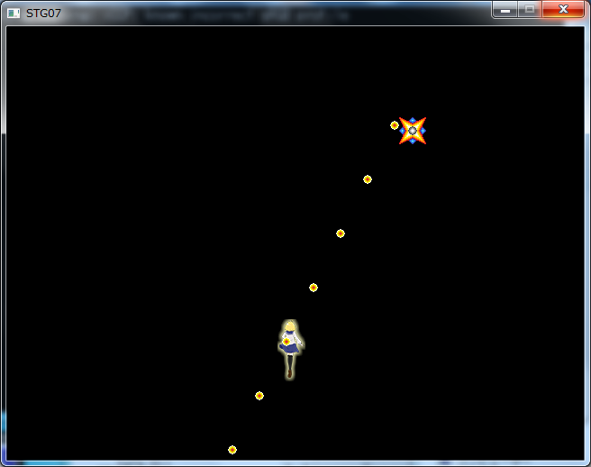
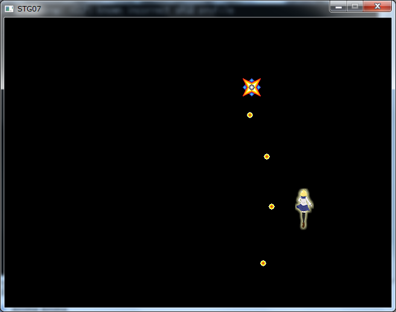

## 07. 敵のショット

### 概要

前回までの内容で、画面上を動く敵を作りました。今回はより敵らしさを増やすべく、弾を撃ってくるようにしましょう。

### 敵の弾クラスの実装

敵の弾は前回に作成した`Enemy`と同様に初期位置と速度ベクトルを与え、初期位置から毎フレーム速度ベクトル分だけ移動する仕様としましょう。
実装の要領と仕様は、それと変わりません。異なるのはテクスチャに使用する画像に"Resource/EnemyBullet.png"を使用することぐらいです。

```cs
using System;
using System.Collections.Generic;
using System.Linq;
using System.Text;
using System.Threading.Tasks;

namespace STG
{
    public class EnemyBullet : asd.TextureObject2D
    {
        // 敵弾の速度ベクトル。
        private asd.Vector2DF moveVelocity;

        // コンストラクタ(敵の初期位置を引数として受け取る。)
        public EnemyBullet(asd.Vector2DF pos, asd.Vector2DF movevelocity)
            : base()
        {
            // 敵弾のインスタンスの位置を設定する。
            Position = pos;

            //　画像を読み込み、敵弾のインスタンスに画像を設定する。
            Texture = asd.Engine.Graphics.CreateTexture2D("Resources/EnemyBullet.png");
			
            // 敵弾のインスタンスに画像の中心位置を設定する。
            CenterPosition = new asd.Vector2DF(Texture.Size.X / 2.0f, Texture.Size.Y / 2.0f);
			
            //　敵弾の速度ベクトルを設定する。
            moveVelocity = movevelocity;

        }

        protected override void OnUpdate()
        {
            //　毎フレーム、速度ベクトル分移動する。
            Position += moveVelocity;

            // 画面外に出たら
            var windowSize = asd.Engine.WindowSize;
           　if (Position.Y < -Texture.Size.Y || Position.Y > windowSize.Y + Texture.Size.Y || Position.X < -Texture.Size.X || Position.X > windowSize.X + Texture.Size.X)
          　 {
           　    // 削除する。
          　     Vanish();
          　 }
        }
    }
}
```

### 敵に弾を撃たせる

では、この弾を実際に発射させてみましょう。具体的には`Enemy`クラスの`OnUpdate()`メソッド内にて発射するタイミングがきた時に、これまでのオブジェクト追加の方法通りで`Layer`に`EnemyBullet`オブジェクトのインスタンスを渡すことで発射処理とすることができます。

弾は60フレームに一回撃たせることとします。この間隔を持った行動パターンを制御するにあたってカウンタを導入します。ここでのカウンタは初期値を0として一回`OnUpdate()`関数が呼び出される度に1増えていくようなものとします。このカウンタによる行動パターンの制御はよく使うテクニックなので憶えておきましょう。
このカウンタ変数を60で割った余りが0になる時に、弾を撃ちます。弾の方向としては下に向かって毎フレーム3.0移動するようなものにしてみます。

それではこれまでに述べた仕様を反映させます。`Enemy.cs`を以下のように変更して下さい。

```diff
using System;
using System.Collections.Generic;
using System.Linq;
using System.Text;
using System.Threading.Tasks;

namespace STG
{
    public class Enemy : asd.TextureObject2D
    {
        // 速度ベクトル
        private asd.Vector2DF moveVector;

+        // 毎フレーム1増加し続けるカウンタ変数
+        private int count;

        // コンストラクタ(敵の初期位置を引数として受け取る。)
        public Enemy(asd.Vector2DF pos, asd.Vector2DF movevector)
            : base()
        {
            // 敵のインスタンスの位置を設定する。
            Position = pos;

            //　画像を読み込み、敵のインスタンスに画像を設定する。
            Texture = asd.Engine.Graphics.CreateTexture2D("Resources/EnemyBullet.png");
			
            // 敵のインスタンスに画像の中心位置を設定する。
            CenterPosition = new asd.Vector2DF(Texture.Size.X / 2.0f, Texture.Size.Y / 2.0f);
			
            //　敵の移動速度ベクトルを設定する。
            moveVelocity = movevelocity;

+           // カウンタ変数を0に初期化する。
+           count = 0;
        }

        protected override void OnUpdate()
        {
            // 速度ベクトル分移動する。
            Position += moveVector;

            // 画面外に出たら
            var windowSize = asd.Engine.WindowSize;
    　       if (Position.Y < -Texture.Size.Y || Position.Y > windowSize.Y + Texture.Size.Y || Position.X < -Texture.Size.X || Position.X > windowSize.X + Texture.Size.X)
   　        {
  　             // 削除する。
 　              Vanish();
　           }

+           // カウンタ変数が60の倍数の時
+           if (count % 60 == 0)
+           {
+               // 弾を発射する。
+               asd.Engine.AddObject2D(new EnemyBullet(Position, new asd.Vector2DF(0, 3.0f)));
+           }

+           ++count;
        }
    }
}
```

その射撃の挙動を見るにあたって、敵の数を減らして挙動を変更します。Program.csの`Main`関数を以下のように変更して下さい。

```diff
～（省略）～

+ // 敵オブジェクトを生成する。(速度ベクトル : (0.5,0))
+ asd.Engine.AddObject2D(new Enemy(new asd.Vector2DF(10, 100), new asd.Vector2DF(0.5f, 0)));

- // エンジンに敵のインスタンス1を追加する。(速度ベクトル : (0,1))
- asd.Engine.AddObject2D(new Enemy(new asd.Vector2DF(320, 100), new asd.Vector2DF(0, 1)));

- // エンジンに敵のインスタンス2を追加する。(速度ベクトル : (1,0))
- asd.Engine.AddObject2D(new Enemy(new asd.Vector2DF(400, 150), new asd.Vector2DF(1, 0)));

- // エンジンに敵のインスタンス3を追加する。(速度ベクトル : (1,1))
- asd.Engine.AddObject2D(new Enemy(new asd.Vector2DF(140, 200), new asd.Vector2DF(1, 1)));

～（省略）～
```

実行すると、下に示すように敵が左にゆっくり移動しながら60フレームに一回下に向かって弾を撃ってくるようになると思います。



### 自機に向けて弾を飛ばす

さて、速度ベクトルを指定して毎フレームそのベクトル分移動する弾を実装して、敵がその弾を下に向かって撃ってくるようにしました。また、同時に任意の方向に対して直進する弾がこの時点で実装できています。

敵の弾といえば自機に向かって撃ってくるものも有名です。そこで撃った瞬間の自機の場所に向かって弾をとばしてみましょう。

敵を自機めがけて撃つには、自機の位置の情報が必要になります。現状、敵オブジェクトが自機の位置の情報へアクセスする手段は存在しないため、その手段を設けます。そのためには、自機オブジェクトに対する参照を敵オブジェクトに持たせることとします。その参照は、敵オブジェクトのコンストラクタを通じて渡すことにしましょう。

では実装してみます。`Enemy.cs`の`Enemy`クラスのメンバ変数の定義とコンストラクタの一部を以下のように追加・変更します。

```diff
～省略～
        // 毎フレーム1増加し続けるカウンタ変数
        private int count;

+       // プレイヤーへの参照
+       private Player player;

        // コンストラクタ(敵の初期位置を引数として受け取る。)
- 		public Enemy(asd.Vector2DF pos, asd.Vector2DF movevector)
+       public Enemy(asd.Vector2DF pos, asd.Vector2DF movevector,Player player)
            : base()
        {
            // 敵のインスタンスの位置を設定する。
            Position = pos;

            //　画像を読み込み、敵のインスタンスに画像を設定する。
            Texture = asd.Engine.Graphics.CreateTexture2D("Resources/EnemyBullet.png");
			
            // 敵のインスタンスに画像の中心位置を設定する。
            CenterPosition = new asd.Vector2DF(Texture.Size.X / 2.0f, Texture.Size.Y / 2.0f);
			
            //　敵の移動速度ベクトルを設定する。
            moveVelocity = movevelocity;

            // カウンタ変数を0に初期化する。
            count = 0;

+           // Playerクラスへの参照を保持。
+           this.player = player;
        }
～省略～
```

続いて、`Enemy`クラスの`OnUpdate()`メソッドの射撃処理を、自機めがけて撃つように変更します。ちなみに、前節で作った`EnemyBullet`クラスは弾の速度ベクトルを任意のものに設定できるので、`EnemyBullet`クラスには一切の変更を加えることなくそれを使いまわすことができます。

```diff
～省略～
            // カウンタ変数が60の倍数の時
            if (count % 60 == 0)
            {
+               // 自分の位置から自機の位置へ対するベクトルを計算する。
+               asd.Vector2DF dir = player.Position - Position;

+               // ベクトルの長さを1.5に変更する。
+               asd.Vector2DF moveVelocity = dir.Normal * 1.5f;

                // 弾を発射する。
-				asd.Engine.AddObject2D(new EnemyBullet(Position, new asd.Vector(0, 3.0)));
+               asd.Engine.AddObject2D(new EnemyBullet(Position, moveVelocity));
            }
～省略～
```

最後に、`Enemy`クラスのコンストラクタを改造したので、`Enemy`オブジェクトの生成でコンストラクタを呼び出すときの引数に`Player`クラスのインスタンスを表す変数`player`を渡す必要があります。`Program.cs`の`Main`関数の内容を以下のように変更してください。

```diff
～（省略）～

  // 敵オブジェクトを生成する。(速度ベクトル : (0.5,0))
+ asd.Engine.AddObject2D(new Enemy(new asd.Vector2DF(10, 100), new asd.Vector2DF(0.5f, 0),player));
- asd.Engine.AddObject2D(new Enemy(new asd.Vector2DF(10, 100), new asd.Vector2DF(0.5f, 0)));
～（省略）～
```

さて、これまでの内容をビルドすると…　以下のようなエラーが出てきてしまいました。

```
Enemy.cs(21,16,21,21): error CS0051: Inconsistent accessibility: parameter type 'STG.Player' is less accessible than method 'STG.Enemy.Enemy(asd.Vector2DF, asd.Vector2DF, STG.Player)'
```

エラーの内容をざっと訳すと、「`Player`クラスは`Enemy`クラスのコンストラクタよりもアクセシビリティが少ない」という風になります。`Program.cs`内の`Player`クラスの定義の冒頭を見てみると以下のようになっています。

```
class Player : asd.TextureObject2D
```

ここで、`class`という記述の前には何も書かれていませんが、この状態だとこの`Player`クラスはそれの定義が書かれている.csファイルからのみ参照可能となります。他の.csファイルからも参照できるようにするには、以下のように`class`の前に`public`キーワードを追加します。

```
public class Player : asd.TextureObject2D
```

これでビルドは無事に通り、実行すると以下に示すように一定の間隔で敵が自機めがけて弾を撃ってくるようになると思います。



### もっと弾を撃たせる

シューティングゲームで難易度を上げるのに一番基本的なのは敵の撃つ弾の量を増やすことです。それでは、プレイヤーの周囲めがけて一度に3発の弾を撃つようにしてみましょう。

それでは、`Enemy`クラスの`OnUpdated`メソッドを以下のように変更してください。

```diff
～省略～
            // カウンタ変数が60の倍数の時
            if (count % 60 == 0)
            {
				// 自分の位置から自機の位置へ対するベクトルを計算。
				asd.Vector2DF dir = player.Position - Position;

				// ベクトルの長さを1.5に変更。
				asd.Vector2DF moveVelocity = dir.Normal * 1.5f;

                // 弾を発射する。
				asd.Engine.AddObject2D(new EnemyBullet(Position, moveVelocity));
				
+				// moveVelocity2を時計方向に10.0度回転させたベクトルmoveVelocity2を作成。
+				asd.Vector2DF moveVelocity2 = moveVelocity;
+				moveVelocity2.Degree += 10.0f;

				// moveVelocity2を速度ベクトルとして弾を発射する。
+				asd.Engine.AddObject2D(new EnemyBullet(Position, moveVelocity2));

				// moveVelocity3を反時計方向に10.0度回転させたベクトルmoveVelocity3を作成。
+				asd.Vector2DF moveVelocity3 = moveVelocity;
+				moveVelocity3.Degree -= 10.0f;

				// moveVelocity3を速度ベクトルとして弾を発射する。
+				asd.Engine.AddObject2D(new EnemyBullet(Position, moveVelocity3));
            }
～省略～
```

実行すると、以下のように一定の間隔で敵がプレイヤーの周囲に向かって一度に3発の弾が撃っているのが確認できます。


すべての変更を適用した結果をダウンロードできるようにしておきます。参考にしてください。

[プロジェクト(Windows)](Projects/STG07.zip?raw=true)

[プロジェクト(Mac)]

### まとめ

本章では、敵の弾クラスを定義した上で、敵がプレイヤーもしくはその周囲めがけて弾を撃てるようにしました。次回は、オブジェクト指向の重要な要素である継承を学んだ上で、より複雑な敵とその弾の動きを作ってみましょう。
