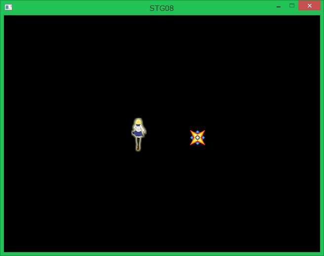
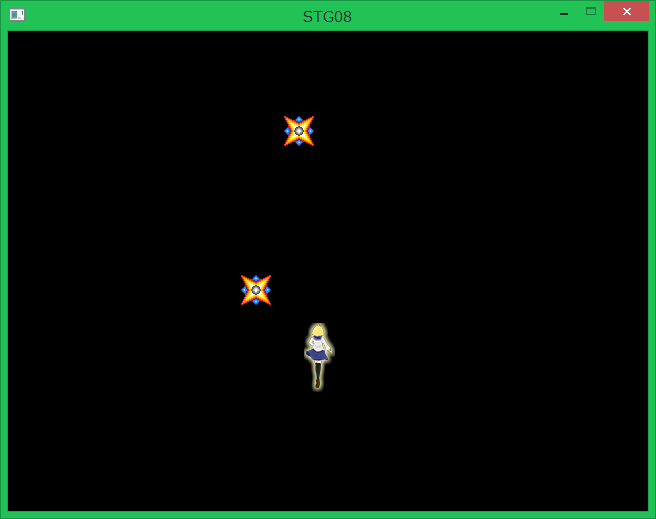
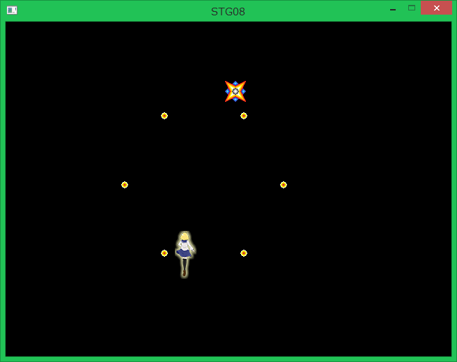

## 08. 複雑な敵の動き

### 概要

前回までの内容で、敵の弾と作って敵がそれを撃ってくるようにしました。今回は第5回にて紹介した継承を用いて異なる動きをする様々な敵や弾を作りましょう。

### 自機に突進してくる敵

まずは、自機に突進してくる敵を実装してみましょう。具体的には、一定時間かけて自機に突進してくる→一定時間停止する　をくり返すという挙動となります。

ソースファイル```RushingEnemy.cs```を作成し、以下のように書いてください。

```cs
using System;
using System.Collections.Generic;
using System.Linq;
using System.Text;
using System.Threading.Tasks;

namespace STG
{
    public class RushingEnemy :Enemy
    {
        //移動の際の速度ベクトル。
        private ace.Vector2DF moveVelocity;

        public RushingEnemy(ace.Vector2DF pos,Player player)
            :base(pos, player)
        {
            //速度ベクトルベクトルを初期化。
            moveVelocity = new ace.Vector2DF();
        }

        protected override void OnUpdate()
        {
            //カウンタ変数を120で割った値を求める。
            int mod = count % 120;

            //mod = 0のとき
            if (mod == 0)
            {
                //その時点での自機に向かう速度ベクトルを求める。
                moveVelocity = (playerRef.Position - Position).Normal * 5.0f;
            }
            else if (mod <= 60) // 1 <= mod <= 60 のとき
            {
                //速度ベクトルをPositionに加算して移動する。
                Position += moveVelocity;
            }

            ++count;
        }
    }
}
```

この```RushingEnemy```は```Enemy```を基底クラスとして継承することで作成します。継承することによって、基底クラスの変数やメソッドを使いまわすことが可能です。このクラスでは基底クラスで宣言済みのPlayerクラスへの参照を示す```playerRef```並びに毎フレームごとに値が増えていくカウンタ変数```count```を使いまわします。

具体的には、カウンタ変数の値を120で割った余りを求め、その値に応じて以下の様な動きをさせます。

* 0 : 速度ベクトル```moveVector```をその時点での自機の位置に向かって毎フレーム5.0移動するように設定する。
* 1 ~ 60 : ```Position```変数に毎フレーム```moveVector```を加算することで移動する。
* 61 ~ 119 : 停止する。（何もしない。）

このソースコードをビルドすると、以下の様なエラーが出て失敗してしまいました。

```
1>(省略)\STG08\STG\RushingEnemy.cs(24,23,24,28): error CS0122: 'STG.Enemy.count' is inaccessible due to its protection level
1>(省略)\STG08\STG\RushingEnemy.cs(30,33,30,42): error CS0122: 'STG.Enemy.playerRef' is inaccessible due to its protection level
1>(省略)\STG08\STG\RushingEnemy.cs(38,15,38,20): error CS0122: 'STG.Enemy.count' is inaccessible due to its protection level
```

以上のエラーを日本語でまとめると「STG.Enemy.countとSTG.Enemy.playerRefはそれらの保護レベル(protection Level)によってアクセス出来ない。」という意味になります。、つまり継承クラスからこの二変数にはアクセス出来ないということです。
これを修正すべく、```Enemy```クラスの記述内の変数```count```と```playerRef```の宣言を見てみましょう。これらは以下のように書かれています。

```cs
//自機への参照を持つ変数。
private Player playerRef;

//1フレームごとに1増加していくカウンタ変数。
private int count;
```

それぞれの冒頭に```private```と書かれていますが、これを書くことによって、この変数はこの宣言を書いたクラス内からのみ参照可能という意味になります。宣言を書いたクラスに含め、継承先のクラスのクラスからも参照できるようにするには、以下のように```private```を```protected```に書き換えます。

```cs
//自機への参照を持つ変数。
protected Player playerRef;

//1フレームごとに1増加していくカウンタ変数。
protected int count;
```

これによってビルドが通りましたね。それでは、```Program.cs```の```Main```関数を変更して、この敵をゲームに登場させましょう。

```cs
～省略～

// レイヤーに自機オブジェクトを追加する。
layer.AddObject(player);

//======== 変更されるソースコード ========//

//突進する敵オブジェクトを生成する。
RushingEnemy rushingEnemy = new RushingEnemy(new ace.Vector2DF(320, 100), player);
//レイヤーに突進する敵オブジェクトを追加する。
layer.AddObject(rushingEnemy);

//======== ここまで ========//

// シーンを切り替える。
ace.Engine.ChangeScene(scene);

～省略～
```

実行すると、以下に示すように敵が自機めがけて突進→停止を一定の間隔でくり返すことが確認できます。



### 反復して移動する敵(三角関数使用版)

第06回で左右に反復して移動する敵を作りましたが、方向転換の時に減速もなしにいきなり逆方向に行くため、その瞬間がどうも不細工に見えてしまいます。そこで、方向転換が近い時に減速し、逆方向に行った瞬間から加速し始めるような反復して動く敵を作ってみましょう。

ソースファイル```GentlyMovingEnemy.cs```を作成し、以下のように書いてください。

```cs
using System;
using System.Collections.Generic;
using System.Linq;
using System.Text;
using System.Threading.Tasks;

namespace STG
{
    public class GentlyMovingEnemy : Enemy
    {
        //移動の際の基準となる位置。
        private ace.Vector2DF basePosition;

        public GentlyMovingEnemy(ace.Vector2DF pos, Player player)
            : base(pos, player)
        {
            //移動の際の基準となる位置を初期化
            basePosition = pos;
        }

        protected override void OnUpdate()
        {
            //basePositionに(X,Y) = ( sin(count*2) , 0 )のベクトルをX,Y成分それぞれ50.0倍した結果を新たな位置とする。
            Position = basePosition + 50.0f * new ace.Vector2DF((float)Math.Sin((count * 2) * Math.PI / 180.0f), 0);

            ++count;
        }
    }
}
```

この動きを実現するにあたって、三角関数のsinを使用するのですが、こちらはC#の標準ライブラリに含まれている数学関数のSinを使用します。これは名前空間```System```内に宣言された静的クラス```Math```内に書かれています。
[MSDNに記されているSin関数の記事](https://msdn.microsoft.com/ja-jp/library/system.math.sin(v=vs.110).aspx)を見てみましょう。どうやらラジアン値を引数```(a)```として与えると、```sin(a)```が返ってくる関数のようです。

さて、Sinに引数として与える```count*2```は度数値なのでラジアン値に変換する必要があります。変換するには度数値をdとして以下のようにします。

```
 r = d * π / 180
```

上の式の```π```は```Math.PI```に定義されているのでそれを使用します。上記の変換式で変換した値をMath.Sinに与えるとその計算した値が返り値として返ってくるのですが、その返り値の型はdouble型となっております。この値をace.Vector2DFのコンストラクタで渡すのですが、その引数はいずれもfloat型となっています。C#においてdouble型からfloat型への暗黙的な型変換は許されていないため、その変換を明示する必要があります。
これらを踏まえて、以下に示すようにして明示的なキャストによりSinの返り値の値をfloat型に変換します。

```
(float)Math.Sin((count * 2) * Math.PI / 180.0f)
```

これで```basePosition```に加算するベクトルが準備出来ました。三角関数sinの値の値域は-1～+1なので、その値域が-50～+50になるよう```50.0f```を乗算します。この最終的な値を```basePosition```に加算した結果を敵の位置とすることで完成です。

それでは、この反復して移動する敵の三角関数版も以下のように```Program.cs```の```Main```関数を一部変更することでゲーム上に登場させましょう。

```cs
～省略～

// レイヤーに自機オブジェクトを追加する。
layer.AddObject(player);

//突進する敵オブジェクトを生成する。
RushingEnemy rushingEnemy = new RushingEnemy(new ace.Vector2DF(320, 100), player);
//レイヤーに突進する敵オブジェクトを追加する。
layer.AddObject(rushingEnemy);

//======== 追加するソースコード ========//

//突進する敵オブジェクトを生成する。
GentlyMovingEnemy gentlyMovingEnemy = new GentlyMovingEnemy(new ace.Vector2DF(320, 100), player);
//レイヤーに突進する敵オブジェクトを追加する。
layer.AddObject(gentlyMovingEnemy);

//======== ここまで ========//

// シーンを切り替える。
ace.Engine.ChangeScene(scene);

～省略～
```

実行結果を見ると、以下に示すように突進する敵と新・反復して動く敵が表示されているのが分かります。



### ```Enemy```クラスの内容を最低限のものにする

ここまで、```Enemy```クラスを継承していろんな動きのパターンを持つ敵を作ってきましたが、この継承元である```Enemy```クラスの内容を一回見返してみましょう。このクラスの挙動は前回の講習の内容によると、「左右に（加減速無しで）動いて60フレームに一回プレイヤーの周囲に向かって3発の弾を撃つ」というものです。
さて、この```Enemy```を継承した```RushingEnemy```と```GentlyMovingEnemy```が```Enemy```から引き継いで使用しているのは…

* 初期位置の設定
* Playerクラスへの参照
* テクスチャ画像
* 1フレームごとに1増加するカウンタ変数

のわずか4つです。それ以外の機能は一切使用しないため、無駄になってしまいます。特に反復して移動するのを制御するための変数(```leftLimit```等)と弾を打つときの処理は一切使うことがありません。もとい、反復して移動するための制御に使う変数は使いまわすようなものではありません。
そこで、```Enemy```の内容を使いまわしている物のみの最低限に減らし、反復して移動する内容は新たなクラス```MovingEnemy```に切り分けましょう。

まずは、```MovingEnemy```への切り分けからやっていきましょう。```MovingEnemy.cs```を作成し、以下のように記述してください。

```cs
using System;
using System.Collections.Generic;
using System.Linq;
using System.Text;
using System.Threading.Tasks;

namespace STG
{
    public class MovingEnemy :Enemy
    {
        //キャラクターが移動できる範囲の左端位置を保存する変数。
        private ace.Vector2DF leftLimit;

        //キャラクターが移動できる範囲の右端位置を保存する変数。
        private ace.Vector2DF rightLimit;

        //キャラクターが現状左に移動している : true, 右に移動している : false。
        private bool isGoingLeft;

        public MovingEnemy(ace.Vector2DF pos, Player player)
            : base(pos, player)
        {
            //移動可能な左端位置を設定。(初期位置から左に50)
            leftLimit = Position - new ace.Vector2DF(50, 0);

            //移動可能な右端位置を設定。(初期位置から右に50)
            rightLimit = Position + new ace.Vector2DF(50, 0);

            //最初は左に向かって移動する。
            isGoingLeft = true;
        }

        protected override void OnUpdate()
        {            
            //左に向かって移動する。
            if (isGoingLeft)
            {
                Position -= new ace.Vector2DF(2.0f, 0);

                //位置が移動可能な範囲の左端を超えたとき。
                if (Position.X <= leftLimit.X)
                {
                    //右への移動に切り替える。
                    isGoingLeft = false;

                    //左端を超えないように、補正する。
                    Position = new ace.Vector2DF(leftLimit.X, Position.Y);
                }
            }
            else //右に向かって移動する。
            {
                Position += new ace.Vector2DF(2.0f, 0);

                //位置が移動可能な範囲の右端を超えたとき。
                if (Position.X >= rightLimit.X)
                {
                    //左への移動に切り替える。
                    isGoingLeft = true;

                    //右端を超えないように、補正する。
                    Position = new ace.Vector2DF(rightLimit.X, Position.Y);
                }
            }
            
            //カウンタの値が60の倍数の時のみ、弾を撃つ。
            if (count % 60 == 0)
            {
                AroundShot();
            }
            ++count;
        }
    }
}
```

このようにして、反復して移動する敵の機能は新たなクラス```MovingEnemy```に切り分けました。続いて、```Enemy```クラスの内容を最低限に絞り込みましょう。

```cs
using System;
using System.Collections.Generic;
using System.Linq;
using System.Text;
using System.Threading.Tasks;

namespace STG
{
    public class Enemy : ace.TextureObject2D
    {
        //自機への参照を持つ変数。
        protected Player playerRef;

        //1フレームごとに1増加していくカウンタ変数。
        protected int count;

        //コンストラクタ(敵の初期位置と自機への参照を引数として受け取る。)
        public Enemy(ace.Vector2DF pos,Player player)
            : base()
        {
            //現在地を初期位置を設定。
            Position = pos;

            //自機への参照を保持。
            playerRef = player;

            //カウンタの初期値を0にする。
            count = 0;

            //敵のテクスチャに使用する画像を読み込んで、設定。
            Texture = ace.Engine.Graphics.CreateTexture2D("Resources/Enemy.png");

            //敵のテクスチャの描画原点を、画像の中心に設定する。(テクスチャサイズが(30,30)なのでその中心は(15,15))
            CenterPosition = new ace.Vector2DF(15.0f, 15.0f);
        }

        protected void AroundShot()
        {
            //自機に向かって弾を撃つ。
            Layer.AddObject(new EnemyBullet(Position, playerRef.Position));

            //敵から見て自機の左方向に10度ずらしたところに向かって弾を撃つ。
            var dir1 = playerRef.Position - Position;
            dir1.Degree -= 10.0f;
            Layer.AddObject(new EnemyBullet(Position, Position + dir1));

            //敵から見て自機の右方向に10度ずらしたところに向かって弾を撃つ。
            var dir2 = playerRef.Position - Position;
            dir2.Degree += 10.0f;
            Layer.AddObject(new EnemyBullet(Position, Position + dir2));
        }
    }
}
```

大分すっきりしましたね。```Enemy```クラスにあったプレイヤーの周囲に対する射撃の内容は継承先で使いまわす可能性があるため、```Enemy```クラス内にprotectedメソッドの```AroundShot()```メソッドとして定義しておきましょう。

### 渦状に弾を拡散する

渦上に弾を拡散する敵を実装してみましょう。```Enemy```クラスに下に示すような```VortexShot()```メソッドを追加してください。

```cs
protected void VortexShot(float degree)
{
	ace.Vector2DF dirVector = new ace.Vector2DF(1, 0);
	dirVector.Degree = degree;
	Layer.AddObject(new EnemyBullet(Position, Position + dirVector));
}
```

次に、このメソッドを呼び出すことで実際に弾を発射する敵を作りましょう。```VortexShotEnemy.cs```を作成し、以下に示すようにして```VortexShotEnemy```クラスを定義してください。

```cs
using System;
using System.Collections.Generic;
using System.Linq;
using System.Text;
using System.Threading.Tasks;

namespace STG
{
    public class VortexShotEnemy :Enemy
    {
        public VortexShotEnemy(ace.Vector2DF pos, Player player)
            : base(pos, player)
        {

        }

        protected override void OnUpdate()
        {
            //渦ショット
            if (count % 2 == 0)
            {
                VortexShot(count * 10);
            }
            ++count;
        }
    }
}
```

もうおなじみの```Program.cs```の```Main```関数の一部を以下のように書き換えて``VortexShotEnemy```をゲーム上に登場させます。

```cs
～省略～

// 自機オブジェクトを生成する。
Player player = new Player();

// レイヤーに自機オブジェクトを追加する。
layer.AddObject(player);

//======== 変更されるソースコード ========//

//渦上に弾を撃つ敵オブジェクトを生成する。
VortexShotEnemy vortexShotEnemy = new VortexShotEnemy(new ace.Vector2DF(320.0f, 240.0f), player);
//レイヤーにうず上に弾を撃つ敵オブジェクトを追加する。
layer.AddObject(vortexShotEnemy);

//======== ここまで ========//

// シーンを切り替える。
ace.Engine.ChangeScene(scene);

～省略～
```

これも実行して結果を見てみましょう。以下に示すようにうず上に弾を撃つ敵が画面の中心に現れて弾を渦状に撃っているのが分かります。


### 分裂する弾

最後に、```EnemyBullet```クラスを継承して分裂する弾を作ってみましょう。```SplitEnemyBullet.cs```を作って```SplitEnemyBullet```クラスを以下のように定義しましょう。

```cs
using System;
using System.Collections.Generic;
using System.Linq;
using System.Text;
using System.Threading.Tasks;

namespace STG
{
    public class SplitEnemyBullet :EnemyBullet
    {
        //1フレームごとに1増加していくカウンタ変数。
        private int count;

        //分裂するときのカウンタの値を保存する変数。
        private int splitCount;

        public SplitEnemyBullet(ace.Vector2DF startPos, ace.Vector2DF destination, int splitcount)
            : base(startPos, destination)
        {
            //カウンタの初期値を0に設定。
            count = 0;

            //分裂するときのカウンタの値を設定。
            splitCount = splitcount;

            //分裂する弾独自のテクスチャを設定する。
            Texture = ace.Engine.Graphics.CreateTexture2D("Resources/SplitEnemyBullet.png");
        }

        protected override void OnUpdate()
        {
            //基底クラス(EnemyBullet)のOnUpdateメソッド内にある目的地に向かって移動する処理と
            //画面外に出た時に消去する処理は使いまわせるので、使いまわす。
            base.OnUpdate();

            //カウンタの値が分裂時の値に達した時。
            if (splitCount==count)
            {
                //全6方向に対して弾(EnemyBullet)を発射する。
                for(int i=0;i<6;++i)
                {
                    ace.Vector2DF dir = new ace.Vector2DF(1, 0);
                    dir.Degree = i * 60;
                    Layer.AddObject(new EnemyBullet(Position, Position + dir));
                }

                //これ自身は消去する。
                Vanish();
            }
            ++count;
        }
    }
}
```

このクラスを定義するにあたって継承前のクラスと比べてコンストラクタの引数が一つ増えています。この引数を通じて何フレーム目に弾が分裂するかを設定します。コンストラクタにてTexture変数にテクスチャを設定していますが、この処理を書くことによって使用するテクスチャを```EnemyBullet```に使用している物から独自の物に変更することが出来ます。
細かく説明すると、基底クラスのコンストラクタが呼ばれた後に当該クラスのコンストラクタが呼び出されるので、```EnemyBullet```クラスコンストラクタ内の```Texture = ace.Engine.Graphics.CreateTexture2D("Resources/EnemyBullet.png");```が呼び出された後、```Texture = ace.Engine.Graphics.CreateTexture2D("Resources/SplitEnemyBullet.png");```が呼び出されることで、その内容は上書きされます。
続いて、```OnUpdate()```メソッドについては、基底クラス(```EnemyBullet```)の```OnUpdate()```内の移動処理と画面外に出た時の消去処理を使いまわせるため、```base.OnUpdate()```メソッドを用いて呼び出します。
この```SplitEnemyBullet```自体の処理としては、```count```の値を毎フレームごとに1増やし続け、```splitCount```の値と同値になった時に分裂します。分裂後の弾は360度全方向に60度の間隔で計6発出ます。そしてこの分裂前の```SplitEnemyBullet```オブジェクト自体はその瞬間に削除します。

さて、この弾を撃つ処理も```Enemy```クラスの継承先全体から使えるようにしましょう。```Enemy```クラスに以下の内容を書き加えてください。
```cs
protected void SplitShot(int splitCount)
{
	//自機に向かって分裂する弾を撃つ。(splitCountで指定した回数フレームが経過すると分裂)
	Layer.AddObject(new SplitEnemyBullet(Position, playerRef.Position, splitCount));
}
```

さて、この弾は```GentlyMovingEnemy```に撃たせてみましょう。```GentlyMovingEnemy.cs```を以下のように変更してください。分裂するのは撃ってから45フレーム後とします。

```cs
using System;
using System.Collections.Generic;
using System.Linq;
using System.Text;
using System.Threading.Tasks;

namespace STG
{
    public class GentlyMovingEnemy : Enemy
    {
        //移動の際の基準となる位置。
        private ace.Vector2DF basePosition;

        public GentlyMovingEnemy(ace.Vector2DF pos, Player player)
            : base(pos, player)
        {
            //移動の際の基準となる位置を初期化
            basePosition = pos;
        }

        protected override void OnUpdate()
        {
            //basePositionに(X,Y) = ( sin(count*2) , 0 )のベクトルをX,Y成分それぞれ50.0倍した結果を新たな位置とする。
            Position = basePosition + 50.0f * new ace.Vector2DF((float)Math.Sin((count * 2) * Math.PI / 180.0f), 0);

			//240フレームに一回分裂する弾を撃つ。(分裂するのは発射してから45フレーム経過後)
            if (count % 240 == 0)
            {
                SplitShot(45);
            }

            ++count;
        }
    }
}
```

でもって、おなじみ```Main```関数を以下のように変更です。

```cs
～省略～

// 自機オブジェクトを生成する。
Player player = new Player();

// レイヤーに自機オブジェクトを追加する。
layer.AddObject(player);

//======== 変更されるソースコード ========//

//敵オブジェクトを生成する。
GentlyMovingEnemy gentlyMovingEnemy = new GentlyMovingEnemy(new ace.Vector2DF(320.0f, 100.0f), player);
//敵オブジェクトを追加する。
layer.AddObject(gentlyMovingEnemy);

//======== ここまで ========//

// シーンを切り替える。
ace.Engine.ChangeScene(scene);

～省略～
```

実行すると、下に示した一つ目のスクリーンショットのように青い弾が出てきた後に、二つ目のスクリーンショットに示したように青い弾が消えて6つの弾に分裂します。




### まとめ

本章では、いろんな動きの敵や敵の弾を作りました。次回は、自機や敵が衝突したか否かを調べる当たり判定を実装しましょう。

