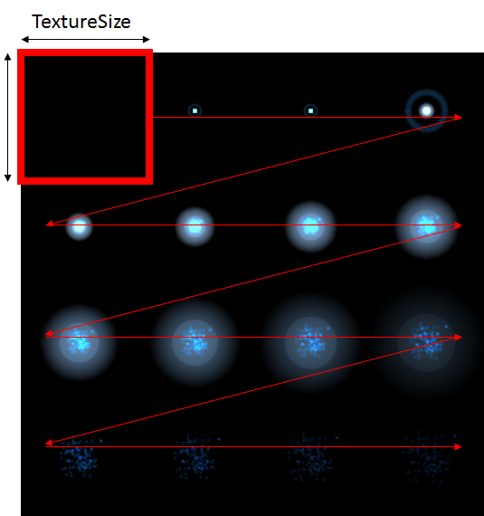
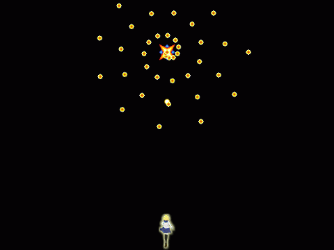

## 10. 敵を倒した時の処理

### 概要

前回までの内容で、自機と敵・敵と自機の弾がそれぞれ衝突した時の当たり判定を実装しました。
そして、実際に自機と敵、敵と自機の弾が衝突すると自機や敵が消滅するようにしました。
しかし、衝突した瞬間に自機や敵が消えると何が起こったかわかりにくいです。
そこで、今回は自機や敵が消えた時に衝撃波のエフェクトが表示されるようにしましょう。

### エフェクトを表示するクラス

まず、エフェクトを表示するクラスを用意しましょう。そのクラスでは以下の画像を表示します。


衝撃波のエフェクトが順番に並んでいます。これは左上が最初で、右に進んでいき、右に行ききったら1弾下に移動して左に戻ります。
横方向に4枚、縦方向に4枚の画像が並んでおり、合計16枚の画像があります。
毎フレーム、1枚ずつ画像が切り替わり16枚表示し終わった後に再生が終わります。

`asd.TextureObject2D` を継承することで、そのような挙動を実現するクラスを実装します。

衝撃波のエフェクトを表示するクラスは以下のソースコードになります。
新規作成で`BreakObjectEffect.cs`というファイルを作成して、このソースコードを記述しましょう。

```cs
using System;
using System.Collections.Generic;
using System.Linq;
using System.Text;
using System.Threading.Tasks;

namespace STG
{
	// オブジェクトが破壊された時に表示されるエフェクト
	public class BreakObjectEffect : asd.TextureObject2D
	{
		// エフェクトの1コマあたりのテクスチャの1辺あたりの長さ
		const int TextureSize = 128;

		// 横方向のコマ数
		const int TextureXCount = 4;

		// 縦方向のコマ数
		const int TextureYCount = 4;

		// 毎フレーム1増加し続けるカウンタ変数
		protected int count;

		// コンストラクタ(初期位置を引数として受け取る。)
		public BreakObjectEffect(asd.Vector2DF pos)
			: base()
		{
			// インスタンスの位置を設定する。
			Position = pos;

			// 画像の中心位置を設定する。
			CenterPosition = new asd.Vector2DF(TextureSize / 2, TextureSize / 2);

			//　画像を読み込み、敵のインスタンスに画像を設定する。
			Texture = asd.Engine.Graphics.CreateTexture2D("Resources/BreakObject.png");

			// 設定された画像で実際に表示する範囲を設定する。
			Src = new asd.RectF(0, 0, TextureSize, TextureSize);

			// アルファブレンドの方法を加算に変更する。
			AlphaBlend = asd.AlphaBlendMode.Add;
		}

		protected override void OnUpdate()
		{
			// 表示するアニメーションの位置を計算する。
			int x = count % TextureXCount;
			int y = count / TextureXCount;

			// 設定された画像で実際に表示する範囲を設定する。
			Src = new asd.RectF(x * TextureSize, y * TextureSize, TextureSize, TextureSize);

			// アニメーションが再生し終わったら削除する。
			if (count == TextureXCount * TextureYCount)
			{
				Dispose();
			}

			++count;
		}
	}
}

```

内容自体は殆どいままでに覚えた知識で理解できます。
今回新規に増えた部分は、`Src` と `AlphaBlend` です。

まず、`Src`について説明します。いままでは`Texture`に設定された画像全てを描画していました。しかし、今回は画像の一部を描画する必要があります。
そこで、`Src` を使用します。` Src ` に値を設定すると、指定された範囲の画像が描画されるようになります。

以下のソースコードで最初に表示される領域を指定しています。

```
Src = new asd.RectF(0, 0, TextureSize, TextureSize);
```

以下のソースコードで表示される領域を移動しています。

```
// 表示するアニメーションの位置を計算する。
int x = count % TextureXCount;
int y = count / TextureXCount;

// 設定された画像で実際に表示する範囲を設定する。
Src = new asd.RectF(x * TextureSize, y * TextureSize, TextureSize, TextureSize);
```

赤い線で囲まれた領域は `asd.RectF(0, 0, TextureSize, TextureSize)` で指定された領域です。そこから矢印の方向に向かって移動していきます。

countは毎フレーム増えていきます。

そのcountを、TextureXCountで割って表示領域を設定しています。

余りをx方向の表示領域としています。余りなので、TextureXCountに指定されている4以上にはならず、0,1,2,3,0,1,2,3...というように値が変化していきます。

商をy方向の表示領域としています。商なので、TextureXCountを区切りに1ずつ増えていき、0,0,0,0,1,1,1,1,2...というように値が変化していきます。

その結果、左上から右上に表示領域が移動していくようになります。



最後にアニメーションの再生が終わったら削除します。

```
// アニメーションが再生し終わったら削除する。
if (count == TextureXCount * TextureYCount)
{
	Dispose();
}
```

`AlphaBlend` は画像を表示するときに背景と描画される画像がどう合成されるか、という設定です。
単純に色を置き換えるだけでなく、足したり引いたりできます。

今回のエフェクトは衝撃波であり、明るくなってほしいため足すように設定しています。
この設定に関して、詳しくは13章で説明されるので、それをお待ちください。

[13章:背景を加算合成する](13.md#sec4)


ちなみに
```cs
		// エフェクトの1コマあたりのテクスチャの1辺あたりの長さ
		const int TextureSize = 128;

		// 横方向のコマ数
		const int TextureXCount = 4;

		// 縦方向のコマ数
		const int TextureYCount = 4;

```
で登場した`const`というキーワードは、定数だということを示しています。
定数とは、変数の中身が絶対に変わらない版のようなものです。

決まっている値を直接書くのではなく定数を使うことで、異なる場所で何度も使っていても、定数の定義さえ書き換えれば全部を書き換えたことになり、書き換え忘れなどのミスを防ぐことができます。


### 消滅した時にエフェクトを表示しよう

今回作成したエフェクトクラスをエンジンに`AddObject2D`メソッドで追加すれば、エフェクトが再生されるはずです。9章では、自機や敵機が被弾した際に呼ばれるメソッド`OnCollide`を作成しましたので、そこでエンジンへの追加を行うようにすればよいでしょう。

削除された時にエフェクトが出て欲しい、`Player` クラスと ` Enemy` クラスの`OnCollide`メソッドにそれぞれ以下のコードを追加します。

`Player` クラス

```cs
public void OnCollide(CollidableObject obj)
{
+   // このインスタンスと同じ位置にエフェクトインスタンスを生成して、エンジンに追加する。
+   asd.Engine.AddObject2D(new BreakObjectEffect(Position));
    Dispose();
}
```

`Enemy` クラス

```cs
public virtual void OnCollide(CollidableObject obj)
{
+    // このインスタンスと同じ位置にエフェクトインスタンスを生成して、エンジンに追加する。
+    asd.Engine.AddObject2D(new BreakObjectEffect(Position));
    Dispose();
}
```

正しく実装されると以下の映像のように倒した瞬間にエフェクトが表示されるようになります。




すべての変更を適用した結果をダウンロードできるようにしておきます。参考にしてください。

[プロジェクト(Windows)](Projects/STG10.zip?raw=true)

[プロジェクト(Mac)]

### まとめ

本章では、衝突した破壊された時にエフェクトが発生するようにしました。
ゲームとしては最低限の要素は揃いましたが、タイトル画面がないので次回はシーン遷移を実装します。

