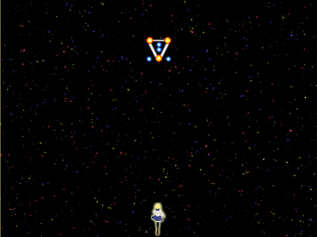
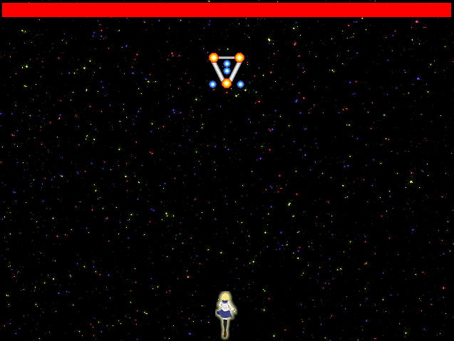
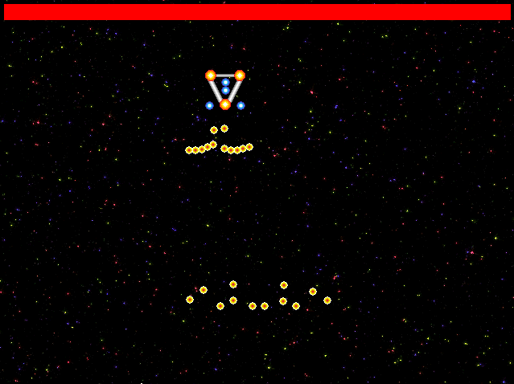
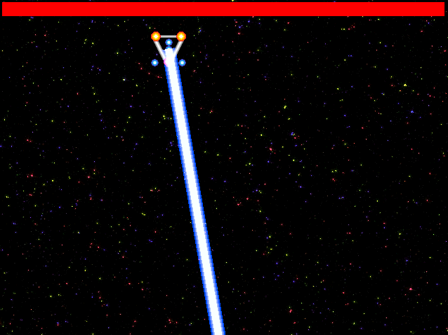

## 14. ボスを実装してみよう

### 概要

前章「 [13. ゲーム画面の背景を実装してみよう](13.md) 」では背景を扱うことができるようになりました。

本章では、ゲームの大きな要素にもなる「ボス」を実装します。本章で扱う「ボス」は、簡単のために以下の要件を満たすものとします。

* HPがある（一発の弾では倒れない）
* ランダムに動く
* 複数の攻撃パターンがある

雑魚敵と区別することができればそれは「ボス」と呼べるでしょう。これを「大ボス」へと昇華するには「ボスどうしの差別化」が必要となるはずですが、ここでは「ボス」を実装することに注力しようと思います。

なお、本章では C# における**乱数**を使用します。

[＠IT：.NET TIPS 乱数を生成するには？ - C#](http://www.atmarkit.co.jp/fdotnet/dotnettips/035random/random.html)

### ボスのクラスを作る

`Enemy` クラスを継承した `Boss` クラスを作りたいと思います。

まずは、 `Boss.cs` ファイルをプロジェクトに追加して以下のようなコードを用意しましょう。

```cs
using System;
using System.Collections.Generic;
using System.Linq;
using System.Text;
using System.Threading.Tasks;

namespace STG
{
    public class Boss : Enemy
    {
        public Boss(asd.Vector2DF pos, Player player)
            : base(pos, player)
        {
            // base(pos, player) のところで、Enemyクラスのコンストラクタは実行されています

            // Boss のテクスチャを上書きする
            Texture = asd.Engine.Graphics.CreateTexture2D("Resources/Boss.png");

            // CenterPositionを上書きする
            CenterPosition = new asd.Vector2DF(Texture.Size.X / 2.0f, Texture.Size.Y / 2.0f);
        }

        protected override void OnUpdate()
        {
            // カウンタの増加機能を使いまわすため基底(Enemy)クラスのOnUpdateを呼び出す。
            base.OnUpdate();
        }
    }
}
```

`Boss` クラスは `Enemy` クラスを継承しました。 しかし、`Boss` クラスでは画像が変わるので、その中心位置もずれてしまいます。つまり `Enemy` クラスのコンストラクタが実行された後に、 `Boss` クラスの画像とその中心位置を更新する必要があります。上記のコンストラクタで行われているのはその処理です。


次は、 `GameScene.cs` の `OnRegistered` メソッドでインスタンス化を行います。今回は `Boss` に焦点を当てたいので、 `Enemy` 
クラスのインスタンスを生成せずに、 `Boss` クラスのインスタンスだけを生成するようにします。

`GameScene.cs` の `OnRegistered` メソッドを以下のように編集しましょう

```diff
        protected override void OnRegistered()
        {
            ...（省略）...

            // プレイヤーのインスタンスを生成し、GameScene に登録する。
            player = new Player();

            // レイヤーにプレイヤーのインスタンスを追加する。
            layer.AddObject(player);

-            //敵オブジェクトを追加する。
-            layer.AddObject(new GentlyMovingEnemy(new asd.Vector2DF(320.0f, 100.0f), player));
+            //レイヤーにボスを追加する
+            layer.AddObject(new Boss(new asd.Vector2DF(320.0f, 100.0f), player));

        }
```

問題がなければ、実行してボスが表示できているはずです。



### ボスのHPの実装

「ボスは弾に当たればダメージを受けてHPが減る」ということを念頭に置きましょう。その上で以下のような手順を踏めばボスのHPゲージを表示することができそうです。

1. ボスの最大HPを定義する
2. 最大HPに応じてHPゲージを描画する
3. ダメージを受けた場合に右からHPゲージを消していく
4. HPが0以下になったらボス撃破

#### 最大HPの定義

まず、1.ですが、最大HPを `maxHP` としておきましょう。これとは別に、ボスの現在のHPを持っておく必要があるので、これを `HP` とします。

`maxHP` にはあらかじめ整数を代入します。これを定数として扱い、 `Boss` クラスのコンストラクタで、初めて `HP` に `maxHP` が代入されるという方式にしたいと思います。

これを実装するため、 `Boss` クラスに以下のコードを追加します。

```diff
namespace STG
{
    public class Boss : Enemy
    {
+        // HP関連の宣言
+        // maxHPは定数として代入しておく
+        private const int maxHP = 3000;
+        private int HP;

        public Boss(asd.Vector2DF pos, Player player)
            : base(pos, player)
        {
            // base(pos, player) のところで、Enemyクラスのコンストラクタは実行されています

            // Boss のテクスチャを上書きする
            Texture = asd.Engine.Graphics.CreateTexture2D("Resources/Character_5.png");

            // CenterPositionを上書きする
            CenterPosition = new asd.Vector2DF(Texture.Size.X / 2.0f, Texture.Size.Y / 2.0f);

+            // HPを設定する
+            HP = maxHP;
        }

        protected override void OnUpdate()
        {
            // カウンタの増加機能を使いまわすため基底(Enemy)クラスのOnUpdateを呼び出す。
            base.OnUpdate();
        }
    }
}
```

これで、最大HPを定義することができました。次はHPの可視化です。

#### HPゲージの描画

今回はディテールは拘らず、簡単にHPゲージを実装してみることにします。

Altseed の `TextureObject2D` が有する `DrawLineAdditionally` というメソッドを利用します。

では、HPゲージに必要なものを用意していきます。

* ゲージの長さ : HPの割合
* ゲージの色 : 赤
* ゲージの位置 : 画面上部
* ゲージの太さ : 20px

こんな感じでHPゲージを作っていこうと思います。

まず、`Boss` クラスにHP関連の宣言を追加しましょう

```diff
        // HP関連の宣言
        // maxHP, diameterHPLine は定数として代入しておく
        private const int maxHP = 3000;
        private int HP;
+        private int HPlength;
+        private asd.Color red = new asd.Color(255, 0, 0, 255);
+        private asd.Vector2DF startHPLine;
+        private asd.Vector2DF destHPLine;
+        private const int diameterHPLine = 20;
```

ここでは、HPゲージの長さ・色・左端・右端・を `HPlength`, `red`, `startHPLine`, `destHPLine` として定義しています。

ここで、Altseed が持つ `Color` というクラスを利用して色を設定しています。コンストラクタに渡す引数は、順番に「r値, g値, b値, アルファ値」です。最大値は255となっています。

次に、HPゲージを描画できるように `OnUpdate()` を実装してみます。

```cs
protected override void OnUpdate()
        {
            // HPの表示

            // 表示するHPゲージの長さを計算する
            HPlength = (asd.Engine.WindowSize.X - 10) * HP / maxHP;

            // HPゲージの左端を設定する
            startHPLine = new asd.Vector2DF(5, 15);

            // HPゲージの右端を計算する
            destHPLine = startHPLine + new asd.Vector2DF(HPlength, 0);

            // HPゲージを描画する
            DrawLineAdditionally(startHPLine, destHPLine, red, diameterHPLine, asd.AlphaBlendMode.Blend, 30);

            // カウンタの増加機能を使いまわすため基底(Enemy)クラスのOnUpdateを呼び出す。
            base.OnUpdate();
        }
```

まず、`HPlength` の値を定めます。予め、画面の横のサイズから少し減らした値にHPの割合をかけてこれを長さとします。

次に、`startHPLine` の値を定めます。これは、描画される線の太さを考慮して(5, 15)と定めています。`destHPLine` はこれに `HPLength` だけ横に伸ばした値を定めます。

そして、`DrawLineAdditionally` です。引数にとる値は順番に、「開始位置、終了位置、色、線の直径、描画方法、描画優先度」です。

描画優先度を変えると、そのレイヤーでの描画順番を変えることができます。ここではゲームに登場するキャラクター達よりは上に配置するように `30` と、仮に設定しています。

これを実行してみると、赤いHPゲージが表示されているのが分かると思います。実際に `OnUpdate()` 中に `HP` を減らす処理を書いてみるとHPゲージが減る様子を観察することができるでしょう。



#### ボスに当たり判定をつける

ボスに当たり判定をつけてみよう…となるわけですが、その雛形はすでに `Enemy` クラスで実装されています。 `Enemy` クラスに `CollidableObject` クラスを継承させたことを覚えていますか？

```cs
    public class CollidableObject : asd.TextureObject2D
    {
        // 半径
        public float Radius = 0.0f;

        // 引数に指定したCollidableObjectと自分が衝突しているか、を返す。
        public bool IsCollide(CollidableObject o)
        {
            // 二点間の距離 が お互いの半径の和 より小さい場合にはtrueを返す。
            return (o.Position - Position).Length < Radius + o.Radius;
        }

        // 衝突時の処理を行うメソッドを実装する。
        public virtual void OnCollide(CollidableObject obj)
        {

        }

```

このクラスを継承することで、当たり判定のための基礎が整います。

ただし、 `Boss` クラスにコードを追加しない限りは、 `Enemy` クラスと当たり判定が全く同じになってしまうということです。

**`OnCollide` メソッドを上書きしていない**ので弾に当たれば一瞬でボスは消えますし、

**`Radius` の値**は `Enemy` クラスで使用される画像に準拠したままです。

これを解消したいので `Radius` と `OnCollide` メソッドを `Boss` 用に書きましょう。


まず、 `Boss` クラスのコンストラクタで `Radius` に値を代入します。

```diff
    public Boss(asd.Vector2DF pos, Player player)
            : base(pos, player)
        {
            // base(pos, player) のところで、Enemyクラスのコンストラクタは実行されています

            // Boss のテクスチャを上書きする
            Texture = asd.Engine.Graphics.CreateTexture2D("Resources/Character_5.png");

            // CenterPositionを上書きする
            CenterPosition = new asd.Vector2DF(Texture.Size.X / 2.0f, Texture.Size.Y / 2.0f);

            // HPを設定する
            HP = maxHP;

+            // 当たり判定の半径を上書きする
+            Radius = Texture.Size.X / 2;
        }
```

次に、 `Boss` クラスで `OnCollide` メソッドを再定義します。

先ほど実装した `OnUpdate` メソッドの直下に書くことにします。

```cs
    protected override void OnUpdate()
        {
            // ...(省略)...
        }

    public override void OnCollide(CollidableObject obj)
        {
            // どんなプレイヤーの弾でも当たればHPが50減る
            HP -= 50;
        }
```

ここで、 `override` を使用してメソッドを定義していますが、これは `Enemy` クラスの `OnCollide` を再定義（上書き）していることになります。

この `override` は、継承元のクラスが直接インスタンス化されない場合、つまり色々なクラスの基底クラスとなっている場合には機能を拡張させることができ、クラスを派生させていくのにとても有効です。

あとは、`Boss` クラスが継承する `Enemy` クラスの `OnUpdate` で `CollideWith` メソッドに処理が移り、プレイヤーの弾と衝突した時に、 `OnCollide` が実行されて、 `Boss` のHPが減るということになります。

### ボスをランダムに移動させる

ボスの基本的な移動を実装します。  

HPを持っているボスは簡単に倒れないですし、単調な動きをして勝手に画面外に出ることもありません。かといって、定位置に固定しておくわけにもいきません。  

できるだけ不自然さを排した動きを実現したいと思います。　  

1. `Random` クラスのオブジェクトを用いて乱数を生成する
2. 1. の方法で、ランダムな方向ベクトルを定める。
3. 2. で求めた方向ベクトルに従う速度ベクトルを決める。
4. 一定時間が経過したら 2. に戻る

この手順を踏めば少なくとも不自然ではない移動が実装できます。各々思うところがあれば微調整を加えてもいいと思います。

#### ランダムに位置を決める

乱数を使用するためには `Random` クラスのオブジェクトを生成する必要があります。

```cs
Random rand = new Random();
int randomNumber = rand.Next();
```

この例では、`rand` という `Random`クラスのオブジェクトを生成して、 `rand.Next()` で整数の乱数を生成しています。この乱数を `randumNumber` に設定しているという具合です。

この乱数生成の方法を用いてボスの位置ベクトルをランダムに決めてみましょう。

`Boss.cs` の変更部分は以下の通りです。

まず `Boss` クラスに乱数を使うために変数を宣言します。
```diff
namespace STG
{
    public class Boss : Enemy
    {
+         // 乱数生成に使うために宣言
+        private Random rand = new Random();

        // HP関連の宣言
        // maxHPは定数として代入しておく
        private const int maxHP = 3000;
        private int HP;

        public Boss(asd.Vector2DF pos, Player player)
            : base(pos, player)
        {
            ...(省略)...
        }
    }
}
```

次は `OnUpdate()` で位置を操作するようにします。

```diff
protected override void OnUpdate()
        {
            // HPの表示

            // 表示するHPゲージの長さを計算する
            HPlength = (asd.Engine.WindowSize.X - 10) * HP / maxHP;

            // HPゲージの左端を設定する
            startHPLine = new asd.Vector2DF(5, 15);

            // HPゲージの右端を計算する
            destHPLine = startHPLine + new asd.Vector2DF(HPlength, 0);

            // HPゲージを描画する
            DrawLineAdditionally(startHPLine, destHPLine, red, diameterHPLine, asd.AlphaBlendMode.Blend, 30);

+            // 乱数によって生成したある点をボスの位置とする
+            Position = new asd.Vector2DF(rand.Next() % asd.Engine.WindowSize.X, rand.Next() % asd.Engine.WindowSize.Y);

            // カウンタの増加機能を使いまわすため基底(Enemy)クラスのOnUpdateを呼び出す。
            base.OnUpdate();
        }
```

ボスが影分身するように見えますね。これに `count` がnの倍数の時だけ `Position` を更新するように設定してみます。以下は n が　60 の場合です。

```diff
    protected override void OnUpdate()
    {
        ...(省略)...

+        // 一定の間隔で速度を更新する
+        if(count%60 == 0){
            // 乱数によって生成したある点をボスの位置とする
            Position = new asd.Vector2DF(rand.Next() % asd.Engine.  WindowSize.X, rand.Next() % asd.Engine.WindowSize.Y);
        }
        // カウンタの増加機能を使いまわすため基底(Enemy)クラスのOnUpdateを呼び出す。
        base.OnUpdate();
    }
```

今度は動きこそ落ち着きましたが、非連続的にボスが移動するのは基本的とは呼べないでしょう。連続した動きを目指してみます

#### ランダムに速度を決める

位置に乱数を使うのではなく、速度に乱数を使うようにしてみましょう。つまり、毎回の更新ごとに速度を位置に足すのです。

速度ベクトルを乱数で決めてみます。  
速度ベクトルの向きは、乱数で生成した目標地点に向くようにしてみましょう。  
速度ベクトルの大きさは、単位ベクトルと同じ1としておきましょう。

`Boss.cs` の変更部分は以下の通りです。
まず速度ベクトルの宣言をします。
```diff
namespace STG
{
    public class Boss : Enemy
    {
        // 乱数生成に使うために宣言
        private Random rand = new Random();

+        // ボスの速度の宣言
+        private asd.Vector2DF moveVelocity;

        // HP関連の宣言
        // maxHPは定数として代入しておく
        private const int maxHP = 3000;
        private int HP;

        public Boss(asd.Vector2DF pos, Player player)
            : base(pos, player)
        {
            ...(省略)...
        }
    }
}
```

`OnUpdate()` では位置の更新、速度の更新を実装します。
```diff
protected override void OnUpdate()
    {
        ...(省略)...

+        // ボスの位置を更新
+        Position += moveVelocity;

        // 一定の間隔で速度を更新する
        if(count%60 == 0){
-            // 乱数によって生成したある点をボスの位置とする
-            Position = new asd.Vector2DF(rand.Next() % asd.Engine.WindowSize.X, rand.Next() % asd.Engine.WindowSize.Y);

+        // 乱数で進む目標点を画面上半分に設定する
+        asd.Vector2DF destPos = new asd.Vector2DF(rand.Next() % asd.Engine.WindowSize.X, rand.Next() % asd.Engine.WindowSize.Y /2.0f);

+        // 目標点への速度を、単位ベクトルとして設定する
+        moveVelocity = (destPos - Position).Normal;

        }
        // カウンタの増加機能を使いまわすため基底(Enemy)クラスのOnUpdateを呼び出す。
        base.OnUpdate();
    }
```

これで、ボスをランダムに動かせるようになりました。次は、ボスの動く範囲を設定します。

この辺は `EnemyBullet` クラスに見る画面外処理と似ています。参考にしましょう。

また、同時に `moveVelocity` をランダムに決める過程を `updateRandVelocity`　メソッドにして切り分けます。

まず、`Boss.cs` の `OnUpdate()` を編集しましょう。

```diff
    protected override void OnUpdate()
    {
        ...(省略)...

+        // ボスの位置を更新
+        Position += moveVelocity;

        // 一定の間隔で速度を更新する
        if(count%60 == 0)
        {
-        // 乱数で進む目標点を画面上半分に設定する
-        asd.Vector2DF destPos = new asd.Vector2DF(rand.Next() % asd.Engine.WindowSize.X, rand.Next() % asd.Engine.WindowSize.Y /2.0f);

-        // 目標点への速度を、単位ベクトルとして設定する
-        moveVelocity = (destPos - Position).Normal;

+        //ここで行う処理は、updateRandVelocity に移動させる。
+        updateRandVelocity();

        }

+        // ボスが画面外に出た場合に、速度を更新する
+        else if (Position.Y < Texture.Size.Y / 2.0f
+            || Position.Y > asd.Engine.WindowSize.Y - Texture.Size.Y / 2.0f
+            || Position.X < Texture.Size.X / 2.0f
+            || Position.X > asd.Engine.WindowSize.X - Texture.Size.X / 2.0f)
+        {
+            updateRandVelocity();
+        }
        // カウンタの増加機能を使いまわすため基底(Enemy)クラスのOnUpdateを呼び出す。
        base.OnUpdate();
    }
```

次に、` updateRandVelocity `を定義します。予め`limitSize`を定義しておいて、ボスの移動目標となる座標の範囲を指定しておきます。

```cs
   // updateRandVelocityを定義する
   private void updateRandVelocity()
    {
        // 目標点が画面上半分になるように (x, y)の上限を設定する
        asd.Vector2DF limitSize = new asd.Vector2DF(asd.Engine.WindowSize.X, asd.Engine.WindowSize.Y / 2.0f);

        // (0, 0)から上限のlimitSizeまでの範囲で乱数を生成して、目標座標を設定する
        asd.Vector2DF destPos = new asd.Vector2DF(rand.Next() % limitSize.X, rand.Next() % limitSize.Y);

        // 目的座標への速度の向きを設定し、単位ベクトルとする
        moveVelocity = (destPos - Position).Normal;
    }
```

これで、ボスが画面上部をランダムに動くようになりました。


### ボスに複数の攻撃パターンを持たせる

HPに応じて攻撃パターンを変えるようにしてみましょう。HPが4分の3、半分、4分の1になる時にパターンが変わるとして、4パターン用意しましょう。

敵の攻撃パターンについては [Tips(編集中)]() で特集されています。ここでは気を楽にして、複数の攻撃パターンを持つ「ボス」ができる過程を考えましょう。

#### 雑魚敵の攻撃を流用する

雑魚敵が単体で使ってもそうでもないが、ボスが使えば一味変わるというイメージで実装したいと思います。

ショットを複数の部位で打たせて厚みを持たせてみようと思います。

一応 `Enemy` クラスにも複数のショットが用意されていますが、弾の角度や発射位置を微調整したいので、 `Boss` クラスに新しくショットを定義していきます。単発のショットのやってることはほぼ同じで、それを組み合わせるだけです。

2つのショットを `Boss` クラスで定義します。

まず、 `bossAroundShot` の定義です。

```cs
        private void bossAroundShot()
        {
            // 砲台の位置を設定する
            asd.Vector2DF cannon1Pos = Position + new asd.Vector2DF(-Texture.Size.X / 2.0f, Texture.Size.Y / 2.0f);
            asd.Vector2DF cannon2Pos = Position + new asd.Vector2DF(Texture.Size.X / 2.0f, Texture.Size.Y / 2.0f);

            // 5方向に弾が出るようにする（偶数の場合、場合分けが必要ですが今回は省略しています）
            int nWay = 5;

            // 方向ベクトルを宣言する
            asd.Vector2DF dirVector = new asd.Vector2DF(1, 0);

            //  方向ベクトルの大きさを3とする
            dirVector.Length = 3.0f;

            // 砲台1からプレイヤーに向く角度を設定する
            float degree = (playerRef.Position - cannon1Pos).Degree;

            // nWayの数だけループする(iが0の時がちょうど真ん中にくるように)
            for (int i = -nWay / 2; i <= nWay / 2; i++)
            {
                // 発射角度を i*10 だけずらす
                dirVector.Degree = degree + i * 10;

                // 砲台1からの弾をレイヤーに登録する
                Layer.AddObject(new EnemyBullet(cannon1Pos, dirVector));
            }

            // 砲台2からプレイヤーに向く角度を設定する
            degree = (playerRef.Position - cannon2Pos).Degree;

            // nWayの数だけループする(iが0の時がちょうど真ん中にくるように)
            for (int i = -nWay / 2; i <= nWay / 2; i++)
            {
                // 発射角度を i*10 だけずらす
                dirVector.Degree = degree + i * 10;

                // 砲台2からの弾をレイヤーに登録する
                Layer.AddObject(new EnemyBullet(cannon2Pos, dirVector));
            }


            // 2つの弾を中心から発射する

            // ボスの中心からプレーヤーに向く角度を設定する
            degree = (playerRef.Position - Position).Degree;

            // 一定の角度ずらす
            dirVector.Degree = degree - 8;

            // 弾をレイヤーに登録
            Layer.AddObject(new EnemyBullet(Position, dirVector));

            // 一定の角度ずらす
            dirVector.Degree = degree + 8;

            // 弾をレイヤーに登録
            Layer.AddObject(new EnemyBullet(Position, dirVector));

        }
```

これは `AroundShot` に工夫を加えたもので、手前の2門から5発ずつ発射されます。微妙に発射位置がずれることで弾が交差して厚みを持つ効果を狙ってます。それに加え真ん中から2発。わざと少しずらした弾を発射します。



次は、`bossVortexShot`の定義です。角度を引数にとって、その方向に弾を射出します。`count`など、単調に増加するものを()の中に与えるとうまく動作します。


```cs
        private void bossVortexShot(float degree)
        {
            // 砲台の位置を設定する
            asd.Vector2DF cannon3Pos = Position + new asd.Vector2DF(Texture.Size.X / 2.0f, -Texture.Size.Y / 2.0f);
            asd.Vector2DF cannon4Pos = Position + new asd.Vector2DF(-Texture.Size.X / 2.0f, -Texture.Size.Y / 2.0f);

            // 方向ベクトルを宣言する
            asd.Vector2DF dirVector = new asd.Vector2DF(1, 0);

            // 方向ベクトルの大きさを3とする
            dirVector.Length = 3.0f;

            // 方向ベクトルの向きをdegreeに合わせる
            // degreeが0度だと90度（下向き）を指すようにする
            dirVector.Degree = degree + 90;

            // 弾をレイヤーに登録する
            Layer.AddObject(new EnemyBullet(cannon3Pos, dirVector));

            // 方向ベクトルの向きを-degreeに合わせる
            // 左右対称になるように、degreeが0度だと90度（下向き）を指すようにする
            dirVector.Degree = -degree + 90;

            // 弾をレイヤーに登録する
            Layer.AddObject(new EnemyBullet(cannon4Pos, dirVector));
        }
```

これは `VortexShot` を利用したもので、曲線でプレイヤーを挟むような形をつくっています。構造は簡単で、奧の2門から互いに違う向きの回転で `VortexShot` をしているだけです。


#### レーザーを作ってみる

レーザーの解説が難しくなってしまったので [Tips]() に載せることになりました。追加するソースコードは以下の通りです。

新しく `Laser.cs` を作り以下の内容をコピーしてください。
```cs
using System;
using System.Collections.Generic;
using System.Linq;
using System.Text;
using System.Threading.Tasks;

namespace STG
{
    class Laser : asd.TextureObject2D
    {
        // Player, Bossのインスタンスをコンストラクタでもらう
        private Player player;
        private Boss boss;

        // レーザーの終端・始端
        private asd.Vector2DF destPos;
        private asd.Vector2DF globalPos;

        // レーザーの（終端-始端）のベクトル
        private asd.Vector2DF direction;

        // チャージ・予測線の初期アルファ値
        private byte startAlpha;

        // レーザーの角速度・長さ
        private float angleVelocity;
        private float length;

        // カウンタ
        private int count;

        // レーザーが発射されるカウント・照射している間のカウント
        private int startCount;
        private int validCount;

        

        public Laser(Player playerRef, Boss bossRef)
        {
            // 目標点となるプレイヤー・ボスの参照を保持する
            player = playerRef;
            boss = bossRef;

            // レーザーの角速度を設定する
            angleVelocity = 0.008f;

            // チャージの初期透明度を50とする
            startAlpha = 50;

            // チャージの画像にsplitEnemyBulletを使用する
            Texture = asd.Engine.Graphics.CreateTexture2D("Resources/splitEnemyBullet.png");

            // 中心座標をチャージ画像中心に設定する
            CenterPosition = new asd.Vector2DF(Texture.Size.X/2.0f, Texture.Size.Y/2.0f);

            // レーザーが画面内で途切れないような長さをlengthとして保持する
            direction = new asd.Vector2DF(asd.Engine.WindowSize.X, asd.Engine.WindowSize.Y);
            length = direction.Length;

            // bossの子となることで、Positionがboss.Positionを原点とした相対的な座標となる
            boss.AddChild(this, asd.ChildMode.Position);

            // 絶対座標として globalPos を取得する
            globalPos = GetGlobalPosition();

            // direction の初期の向き・長さを決める
            direction = player.Position - globalPos;
            direction.Length = length;
            
            // 目標座標を割り出す
            // （単純にプレイヤーの座標を割り当てるとレーザーが画面内で途切れてしまう）
            destPos = globalPos + direction;

            // カウンタを初期化する
            count = 0;

            // レーザーが発射されるカウント・照射している間のカウントを保持する 
            startCount = 60;
            validCount = 200;
        }

        protected override void OnUpdate()
        {
            // startCount から validCount 経過したら
            if (count >= validCount + startCount)
            {
                // bossとの親子関係を解消する
                boss.RemoveChild(this);

                // レーザー消滅
                Dispose();
            }

            // startCount に達するまでは
            else if (count < startCount)
            {
                // Scaleでチャージの拡大率を上げる
                Scale += new asd.Vector2DF(0.1f, 0.1f);

                // Colorでアルファ値を設定する
                Color = new asd.Color(255, 255, 255, startAlpha);

                // startCountの数だけアルファ値にこれを足したら255（不透明）になるよう設定する
                startAlpha += (byte)((255-startAlpha)/startCount);

                // 予測線を表示する　
                DrawLineAdditionally(GetGlobalPosition(), destPos, new asd.Color(120, 160, 255, startAlpha), 5, asd.AlphaBlendMode.Add, 0);
            }

            // レーザーが照射されている時の処理
            // プレイヤーのいる方へレーザーの向きを調整する
            else
            {
                // アルファ値を0（透明）にする
                Color = new asd.Color(255, 255, 255, 0);

                // 現在の絶対座標を取得する
                globalPos = GetGlobalPosition();

                // レーザーを向けたい目標の方向ベクトルを設定する
                asd.Vector2DF destDirection = player.Position - globalPos;
                
                // ベクトルの内積を用いて destDirection の direction に平行な成分を parallelVector として取り出す
                asd.Vector2DF parallelVector = asd.Vector2DF.Dot(destDirection, direction) / direction.Length * direction.Normal;

                // ベクトルの差を用いて destDirection の direction に垂直な成分を verticalVector として取り出す
                asd.Vector2DF verticalVector = (destDirection - parallelVector);

                // レーザーの当たり判定の範囲内にプレイヤーがいない場合は
                if (verticalVector.Length > 5 + player.Radius)
                {
                    // 角速度に応じて verticalVector の大きさを設定する
                    direction += verticalVector.Normal * direction.Length * (float)Math.Abs(Math.Tan(angleVelocity));

                    // direction の長さは既定の length を使用する
                    direction.Length = length;

                    // レーザーの目標地点を更新する
                    destPos = globalPos + direction;
                }

                else
                {
                    // 衝突処理
                    player.OnCollide(null);
                }

                // レーザーを加算合成で描画する
                DrawLineAdditionally(GetGlobalPosition(), destPos, new asd.Color(0, 20, 255, 255), 20, asd.AlphaBlendMode.Add, 0);
                DrawLineAdditionally(GetGlobalPosition(), destPos, new asd.Color(40, 50, 255, 255), 16, asd.AlphaBlendMode.Add, 0);
                DrawLineAdditionally(GetGlobalPosition(), destPos, new asd.Color(80, 90, 255, 255), 12, asd.AlphaBlendMode.Add, 0);
                DrawLineAdditionally(GetGlobalPosition(), destPos, new asd.Color(120, 160, 255, 255), 10, asd.AlphaBlendMode.Add, 0);
            
            }

            // bossがDisposeされていたら
            if(!boss.IsAlive)
            {
                // Disposeする
                Dispose();
            }

            // 更新ごとに1つカウントする
            count++;

           
        }

    }
}
```

また、`Boss.cs` ではレーザーを出す `bossLaser` を定義します。

```cs
        private void bossLaser()
        {
            // LaserをBossが制御できるように、Laserのインスタンスの情報をBossが持つようにする
            laserRef = new Laser(playerRef, this);

            // Laserをレイヤーに登録する
            Layer.AddObject(laserRef);
        }
```



これで、ボスの攻撃パターンを3つ定義することができました。攻撃パターンの考え方については[Tips]()を参照してください。

### HPに応じて攻撃パターンを変える

今度は定義した攻撃パターンを用いて、ボスに攻撃させてみましょう。

以下に、`HP` の割合に応じて条件分岐するテンプレートを書いてみました。

```cs
        protected override void OnUpdate()
        {
            ...(省略)...

            // HPの量で行動パターンを変える

            // HPが3/4になる前の状態で
            if (maxHP * 3 / 4 < HP)
            {
                // ここで、攻撃パターンを定義したメソッドを呼び出す
            }
            
            // HPが半分になる前、かつ、HPが3/4を過ぎた状態で
            else if (maxHP / 2 < HP && HP <= maxHP * 3 / 4)
            {
                // ここで、攻撃パターンを定義したメソッドを呼び出す
            }

            // HPが1/4になる前、かつ、HPが半分を過ぎた状態で
            else if (maxHP / 4 < HP && HP <= maxHP / 2)
            {
                // ここで、攻撃パターンを定義したメソッドを呼び出す
            }

            // HPが1/4を過ぎた状態で
            else
            {
                // ここで、攻撃パターンを定義したメソッドを呼び出す
            }

            // HPが0以下ならば
            if (HP <= 0)
            {
                // Bossを消去する
                Dispose();
            }

            // カウンタの増加機能を使いまわすため基底(Enemy)クラスのOnUpdateを呼び出す。
            base.OnUpdate();
        }
```

定義した3つのパターンをうまく利用して、攻撃パターンを差し替えてみましょう。

### 攻撃パターンのサンプル

サンプルでは以下のような攻撃パターンを実装しています。

```cs
            // HPの量で行動パターンを変える

            // HPが3/4になる前の状態で
            if (maxHP * 3 / 4 < HP)
            {
                // 一定の間隔で bossAroundShot をする
                if (count % 60 == 0)
                {
                    bossAroundShot();
                }
            }
            
            // HPが半分になる前、かつ、HPが3/4を過ぎた状態で
            else if (maxHP / 2 < HP && HP <= maxHP * 3 / 4)
            {
                // 一定の間隔で bossVortexShot をする
                if (count % 5 == 0)
                {
                    bossVortexShot(count * 7);
                }

                // 一定の間隔で bossAroundShot をする
                if (count % 60 == 0)
                {
                    bossAroundShot();
                }
            }

            // HPが1/4になる前、かつ、HPが半分を過ぎた状態で
            else if (maxHP / 4 < HP && HP <= maxHP / 2)
            {
                // 一定の間隔で bossVortexShot をする
                if (count % 5 == 0)
                {
                    bossVortexShot(count * 7);
                }

                // レーザーをまだ出してない、または、前打ったレーザーが撃ち終わっている、ならば
                if (laserRef == null || !laserRef.IsAlive)
                {
                    // 一定の間隔で bossLaser をする
                    if (count % 300 == 0)
                    {
                        bossLaser();
                    }
                }
            }

            // HPが1/4を過ぎた状態で
            else
            {
                // 一定の間隔で bossAroundShot をする
                if (count % 60 == 0)
                {
                    bossAroundShot();
                }

                // 一定の間隔で bossVortexShot をする
                if (count % 5 == 0)
                {
                    bossVortexShot(count * 7);
                }

                // レーザーをまだ出してない、または、前打ったレーザーが撃ち終わっている、ならば
                if (laserRef == null || !laserRef.IsAlive)
                {
                    // 一定の間隔で bossLaser をする
                    if (count % 300 == 0)
                    {
                        bossLaser();
                    }
                }
            }


            // HPが0以下ならば
            if (HP <= 0)
            {
                // Bossを消去する
                Dispose();
            }

```


## まとめ

今回の章では、 `Enemy` を継承した `Boss` クラスの「ボス」を作成しました。考えを柔軟に、色々なパターンを作ってみましょう。

今回の章を終了した時点での、プロジェクトのサンプルはこちらになります。参考までに確認してみてください。

[STG14.zip](Projects/STG14.zip?raw=true)
