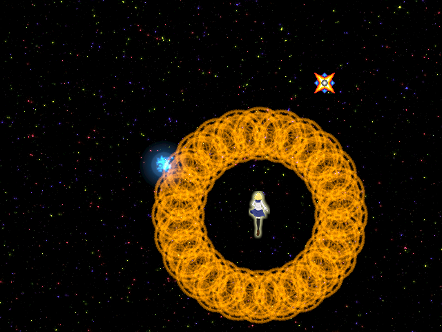

## 18. ボムを作ろう

### 概要

本章では、弾消し効果のあるボムを作っていきます。今回作るボムは、Xキーを押すことで発動し、敵の弾を消し、敵を破壊するたくさんの魔法陣を全方位に展開します。以下の手順でボムを実装していきます。

1. ボムクラスの骨格を作成する
2. Xキーでボムが発動するようにする
3. ボムと敵・敵弾の当たり判定をして、敵を倒せるようにする
4. 効果音を付ける

### ボムが発動するようにする

今回作るボムは、たくさんの魔法陣を周りに発射するものです。そこで、１つ１つの魔法陣を「ボムクラス」に書いて、プレイヤーがXキーを押した時にボムクラスをたくさん生成するようにして作りましょう。まずは新しいファイル「Bomb.cs」を作成し、そこに以下のようにボムクラスを定義します。

```cs
namespace STG
{
	class Bomb : ace.TextureObject2D
	{
		// 経過時間(秒)
		int time;

		// 速度ベクトル
		ace.Vector2DF velocity;

		// コンストラクタ。初期位置と移動方向を引数にとる。
		public Bomb(ace.Vector2DF position, float angle)
		{
			// 魔法陣の画像を読み込んで設定
			Texture = ace.Engine.Graphics.CreateTexture2D("Resources/Bomb.png");

			// 初期位置を設定
			Position = position;

			// 魔法陣の画像の描画原点を中心に設定
			CenterPosition = new ace.Vector2DF(Texture.Size.X / 2.0f, Texture.Size.Y / 2.0f);

			// 速度ベクトルを計算する。
			velocity = new ace.Vector2DF(1, 0);
			velocity.Length = 2.0f;		// velocityに速度を設定
			velocity.Degree = angle;	// velocityに向きを設定
		}

		protected override void OnUpdate()
		{
			// 速度ベクトルのぶんだけ位置を動かす
			Position += velocity;

			// 画像を回転させる
			Angle += 5;

			// 時間を数える。
			++time;

			// 120フレーム経っていたらオブジェクトを消す。
			if(time >= 120)
			{
				Vanish();
			}
		}
	}
}

```

このコードについて解説します。コンストラクタでは、自機の弾と同様に初期位置を引数にとっています。また、全方位に魔法陣を発射するために、魔法陣の動く向きをカスタマイズできるようにしたいので、魔法陣の動く向き（度数法の角度）を引数にとっています。そして、画像と初期位置、描画原点を設定した後、引数にとった向きの値を元に速度ベクトルを計算し、保持します。

実際に魔法陣を移動させるのは`OnUpdate`関数の中です。敵弾などと同じように、速度ベクトルを現在位置に加算することで位置を動かします。また、少し見た目を華やかにするために魔法陣を回転させます。そして、`time`変数を使ってフレーム数を数え、120フレームに達したらオブジェクトを削除するようにしています。以上がボムクラスで行っていることです。

ボムクラスができたので、実際にこれを発射する部分を作りましょう。プレイヤーがXキーを押した時に発射するので、`Player`クラスの`OnUpdate`メソッドに処理を追加しましょう。

```diff
protected override void OnUpdate()
{
	(省略)

    // もし、Zキーを押したら{}内の処理を行う。
    if(ace.Engine.Keyboard.GetKeyState(ace.Keys.Z) == ace.KeyState.Push)
    {
        // 弾を生成する。
        Bullet bullet = new Bullet(Position + new ace.Vector2DF(0, -6));

        // 弾をレイヤーに追加する。
        Layer.AddObject(bullet);
    }

+   // もし、Xキーを押していたら{}内の処理を行う。
+   if(ace.Engine.Keyboard.GetKeyState(ace.Keys.X) == ace.KeyState.Push)
+   {
+       // 24回繰り返す。
+       for(int i = 0; i < 24; i++)
+       {
+           // ボムのインスタンスを作成する。引数に初期位置として自機の位置、向きとして繰り返し変数の値を使った式を渡す。
+           Bomb bomb = new Bomb(Position, 360 / 24 * i);
+           
+           // ボムをレイヤーに追加する。
+           Layer.AddObject(bomb);
+       }
+   }
}
```

コードでは、ショットを打つ時と同様に、Xキーを押した時に魔法陣を発射する処理を追加しました。if文でXキーを押したかどうかを判定し、if文のブロックの中ではfor文を用いて24個の魔法陣を生成するようにしています。ボムの向きとして引数に渡している`360 / 24 * i`とは、「１周の角度 / 24個 * 繰り返しの何回目か」という意味で、こうすることによって一周に24個の魔法陣を発射することができます。

コードを書いたら実行してみましょう。Xキーを押すことでボムが発動するようになったと思います。ただし、敵や敵弾に当てても相手を破壊することはまだできません。


### 敵や敵弾を消せるようにする

次に、敵や敵弾を破壊する機能をこのボムに実装しましょう。ボムの魔法陣と敵との当たり判定をとり、当たっていたら敵を消滅させる、というのが処理の流れになります。

当たり判定は毎フレーム実行する必要がありますので、そのプログラムは`OnUpdate`内に書きましょう。ただし、今回は当たり判定をする部分を別のメソッドに書き、`OnUpdate`内ではそのメソッドを呼び出すようにします。次のようにコードを追加してください。ただし、ここまででは実行しても何も変わりません。

```diff
namespace STG
{
    class Bomb : ace.TextureObject2D
    {
        (省略)

        protected override void OnUpdate()
        {
            // 速度ベクトルのぶんだけ位置を動かす
            Position += velocity;

            // 画像を回転させる
            Angle += 5;

            // 時間を数える。
            ++time;

            // 120フレーム経っていたらオブジェクトを消す。
            if(time >= 120)
            {
                Vanish();
            }

+   		CalcCollision();	// 当たり判定をするメソッドを呼び出す
		}
    
+   	// 敵や敵弾との当たり判定をするメソッド。
+   	private void CalcCollision()
+   	{
+   		// 実装はこれから作る
+   	}
	}
}
```

`CalcCollision`というメソッドを追加しました。このようにした理由は、OnUpdate内には回転や移動、時間による消滅の処理がすでに書かれていて、ここに敵や敵弾との当たり判定処理が混ざってしまうとパッと見た時にどこからどこまでが当たり判定処理なのかが分かりにくくなるからです。メソッドにくくり出して名前をつけることで、その部分でどんな処理をしているのかがパッと見てわかりやすくなります。いろいろな処理を１つのメソッドに書くことになったときは、このように意味のある単位で別のメソッドとしてくくりだし、適切な名前をつけることを検討してみてください。

次に、`CalcCollision`メソッドの中身を作っていきましょう。次のようにコードを追加します。当たっているかどうかを実際に判定をする部分はさらに別のメソッドに分けています。また、まだ実行しても何も変わりません。

```diff
+using System.Linq;

namespace STG
{
    class Bomb : ace.TextureObject2D
    {
        (省略)

        // 敵や敵弾との当たり判定をするメソッド
        private void CalcCollision()
        {
-   		// 実装はこれから作る
+   		// レイヤー上のオブジェクトから敵クラスのインスタンスを抽出
+   		var enemies = Layer.Objects.OfType<Enemy>();
+   		foreach(var item in enemies)
+   		{
+				// 当たっていたら敵を消す
+       		if(IsHit(item.Position, item.Texture.Size.X / 2))
+       		{
+           		item.Vanish();
+       		}
+   		}
+
+   		// レイヤー上のオブジェクトから敵弾クラスのインスタンスを抽出
+   		var bullets = Layer.Objects.OfType<EnemyBullet>();
+   		foreach(var item in bullets)
+   		{
+   			// 当たっていたら敵弾を消す
+       		if(IsHit(item.Position, item.Texture.Size.X / 2))
+       		{
+           		item.Vanish();
+       		}
+   		}
		}

+   	// この魔法陣と渡された円が当たっているか判定する。
+   	private bool IsHit(ace.Vector2DF position, float radius)
+   	{
+       	// 実装はこれから作る
+   		return false;
+   	}
	}
}
```

この中でも次のコードは敵クラスのリストにアクセスしています。

```cs
var enemies = Layer.Object.OfType<Enemy>();
```

右辺の頭から順に解説します。`Object2D`クラスには`Layer`プロパティがあり、これにアクセスすることでそのオブジェクトが登録されているレイヤーを取得することができます。そしてレイヤークラスには`Objects`プロパティがあり、これにアクセスすることでそのレイヤーに登録されているオブジェクトのコレクションを得ることができます。ボムクラスから`Layer.Objects`にアクセスすれば、そこに敵や敵弾のインスタンスが含まれているはずです。最後に、取得したオブジェクトのコレクションから敵クラスだけ、および敵弾クラスだけを絞り込みます。これにはC#のライブラリの機能である`OfType`メソッドを使います。このメソッドによって、コレクションから特定の型のインスタンスだけを抽出することができます。

また、`OfType`を使うには`System.Linq`名前空間をusingしておく必要がありますので、ファイルの先頭に追加しました。すでに書かれている場合はあらためて書く必要はありません。

それから、上記のコードでは当たっているかを実際に判定する部分を別のメソッド`IsHit`にくくり出しています。先ほどと同じように、意味のある部分をメソッドにくくりだして名前を付けたので、そこで何をしているのか（今回の場合、当たっているかどうかを判定する部分であること）が分かりやすくなりました。また、もう一つくくりだす理由として、当たっているかどうかの判定の処理が敵と敵弾で２箇所に書かれそうだったことがあります。似たような処理を繰り返し書くのを避けるためにもメソッドにくくり出す方法を使うことができるので、覚えておくといいでしょう。

長かったですが、`IsHit`メソッドの実装が完了すれば、敵や敵弾がボムによって破壊されるようになります。次のようにコードを追加しましょう。

```diff
namespace STG
{
	class Bomb : ace.TextureObject2D
	{
+		private static readonly float Radius = 35;

		(省略)
        
        // この魔法陣と渡された円が当たっているか判定する。
        private bool IsHit(ace.Vector2DF position, float radius)
		{
-       	// 実装はこれから作る
-   		return false;
+   		ace.Vector2DF d = position - Position;
+   		float r = radius + Radius;
+   		return d.SquaredLength <= r * r;
		}
	}
}
```

円同士の当たり判定のため魔法陣に半径が必要だったので、魔法陣の半径を表す定数`Radius`を追加しました。定数(実行中に変わらない数)を定義するには、メンバ変数に`readonly`を付けます。`readonly`のついた変数は、宣言したその場か、コンストラクタでしか値を代入できなくなります。また、`static`をつけると、普通のコンストラクタからは値を代入できなくなります。

`IsHit`メソッドの中では、[9章](09.md)で解説した円同士の当たり判定を行っています。そして、実行するとボムの魔法陣が当たった敵や敵弾を破壊できるようになりました。



### 効果音を付ける

最後に、ボムを発射した瞬間に効果音を付けましょう。`Player`クラスに以下のようにコードを追加します。

```diff
public class Player : ace.TextureObject2D
{
+   // ボム発動音
+   private ace.SoundSource bombSound;

    public Player()
    {
        // 画像を読み込み、オブジェクトに設定する。
        Texture = ace.Engine.Graphics.CreateTexture2D("Resources/Player.png");

        //自機のテクスチャの描画原点を、画像の中心に設定する。
        CenterPosition = new ace.Vector2DF(Texture.Size.X / 2.0f, Texture.Size.Y / 2.0f);

+   	// ボム発動音をロード
+       bombSound = ace.Engine.Sound.CreateSoundSource("Resources/bomb.wav", true);
    }

    protected override void OnUpdate()
    {
        (省略)

        // もし、Xキーを押していたら{}内の処理を行う。
        if(ace.Engine.Keyboard.GetKeyState(ace.Keys.X) == ace.KeyState.Push)
        {
            // 24回繰り返す。
            for(int i = 0; i < 24; i++)
            {
                // ボムのインスタンスを作成する。引数に初期位置として自機の位置、向きとして繰り返し変数の値を使った式を渡す。
                Bomb bomb = new Bomb(Position, 360 / 24 * i);

                // ボムをレイヤーに追加する。
                Layer.AddObject(bomb);
            }

+   		// ボム発動音を鳴らす
+           ace.Engine.Sound.Play(bombSound);
        }
    }
}
```

コンストラクタ内でメンバ変数に音をロードし、Xキーでボムが発動するときに音を鳴らしています。ロードの際、`CreateSoundSource`の第２引数に渡す値は効果音の場合`true`であることに注意してください。効果音を鳴らすタイミングをボムクラスのコンストラクタではなくプレイヤークラスのXキーを押した場合の処理に書いたのは、ボムが24回生成されるせいで効果音が24回再生されてしまうのを防ぐためです。

### まとめ

今回はボムを作成しました。また、メソッドでプログラムの一部分をくくりだすことでコードを整理する考え方についても解説しました。
