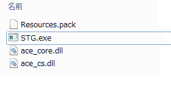

## 20. 公開の準備を整えよう

### 概要

さて、前回までの内容でゲーム本体がめでたく「完成」しました。折角ゲームを作ったのですから、「公開」して他の人に遊んでもらいましょう。
今回は、実際に作ったゲームを「公開」するための準備について解説していきます。

### ファイルパッケージ

まず、現状では画像・音楽などの各種のファイルが外から見えるようになってしまいます。これでは、ゲームをプレイした人に悪意があった場合、素材などをそのままの形で持っていかれてしまう可能性があり、危険です。
そこで、Altseedでは複数のファイルを1つのファイルにまとめて、かつプレイヤーから中身がわからないようにするファイルパッケージ、という機能があります。

今回はファイルパッケージを生成するためのツールと、ファイルパッケージを読み込むAltseedの機能を用いて、
これらのファイルが外から直接見えないように（なおかつ、ゲーム本体からは正しく参照できるように）してみましょう。

複数のファイルを1つにまとめたファイルパッケージを生成するために、Altseedではファイルパッケージジェネレーターというツールを使用します。

今回はファイルパッケージジェネレーターを以下のリンクからダウンロードします。

[ファイルパッケージジェネレーター](Common/FilePackageGenerator.zip?raw=true)

ダウンロードは終わりましたか？それでは、ダウンロードされた圧縮ファイルを解凍しましょう。
解凍したら、FilePackageGenerator.GUI.exeという実行ファイルを探しましょう。

見つけたら、FilePackageGenerator.GUI.exeを起動してみましょう。起動すると、以下の画面が表示されます。


入力欄やボタン数は少なく、「読み込み元(参照)」「パスワード」「出力」の3種類があるのみです。

「読み込み元(参照)」にはパッケージに保存するファイルが存在するディレクトリを入力します。ここに入力されたディレクトリにあるファイルが全てパッケージに保存されます。
今回は、パッケージに保存するディレクトリとして`Resources`を指定します。指定するために、「参照」ボタンを押して`Resources`ディレクトリを指定しましょう。

次に「パスワード」に文字を入力します。これはパッケージを暗号化するためのパスワードです。
ここで指定したパスワードをソースコード上で設定しないとゲームからパッケージが読み込めなくなります。
パスワードは設定しなくても問題ありませんが、設定することでより他の人に中身が知られにくくなります。

今回はパスワードに`1234` を設定しましょう。

最後に、`出力`ボタンを押して保存します。ここでは、`Resources.pack`という名前でbinディレクトリに保存しましょう。


ただ、このままではパッケージを読み込むことはできません。
そこで、Altseedを初期化してからファイルを読み込むまでの間にファイルパッケージを読み込むソースコードを追加します。

``` diff
 // Altseedを初期化する。
asd.Engine.Initialize("STG", 640, 480, new asd.EngineOption());

+ asd.Engine.File.AddRootPackageWithPassword("Resources.pack", "1234");
```

このソースコードを追加すると、通常のディレクトリからファイルを読み込むかわりに、ファイルパッケージの中からファイルを読み込むようになります。

それでは、これで問題ないかというとそうではなく、まだ修正する部分があります。

それは、ファイルを読み込む時のパスです。今回は`Resources`ディレクトリをファイルパッケージに保存しました。
この時、例えば`Resources/abc/def.png`というファイルが存在したとすると、このファイルをファイルパッケージから読み込むファイルパスは`abc/def.png`になります。
ですが、ファイルパッケージを使用していない時は`Resources/abc/def.png`というパスでした。

この違いを修正するために、全ての`Resources/`という文字を削除します。

一つ一つ書き換えてもいいですが、Visual Studioや他のエディタには大抵、文字を置換する機能があります。それを用いて`Resources/`という文字を空欄に置き換えましょう。

Visual Studio 2013の場合、メニューから編集->検索と置換->クイック置換と選択することで文字を置換できます。

置換をした結果、`Resources/`という文字列が消滅しました。この状態で起動すると無事ファイルを読み込め、起動出来ました。

しかし、このままだと今度は開発中の時、Resourcesディレクトリからファイルを読み込めません。

開発中の時は先程のソースコードの部分を以下のように書き換えます。

``` diff
asd.Engine.Initialize("STG", 640, 480, new asd.EngineOption());

- asd.Engine.File.AddRootPackageWithPassword("Resources.pack", "1234");
+ asd.Engine.File.AddRootDirectory("Resources/");
```

ここでは、指定したディレクトリをルートとしてファイルを読み込むようにしています。ファイルパスには`Resources/`より後を設定すればよくなります。

開発中はディレクトリからファイルを読むように、プレイヤーに配布する際はパッケージからファイル読み込むようにしましょう。

なお、この講座ではなくAltseedを普通に使って開発する場合は、
Altseedの開発に必要なDLL等が保存されている圧縮ファイル内のToolディレクトリにファイルパッケージジェネレーターがあります。

### Releaseビルド

現在は、プロジェクトのビルドの際に「Debugビルド」を使用しています。
Debugモードはデバッグ情報を含んでビルドするため、バグの発生時に原因の特定などが非常に容易になっている反面、そのために含まれているデバッグ情報が容量を多くとってしまうという問題があります。
また、Debugモードでは最適化（プログラムが最も高速に動作するようにするための処理）が行われないため、開発に使用しているマシンの性能などによってはプログラムの実行が若干重く感じるかも知れません。

そこで、デバッグ情報を除くことで軽量化し、また最適化（高速化）を行うために、プロジェクトのビルドの際に「Releaseビルド」を使用するようにしてみましょう。
「Debugビルド」から「Releaseビルド」への変更は、Visual Studioのウインドウの下記の場所で行えます。「開始」の右側に「Debug」と書かれているプルダウンメニューがありますので、▼を押して出てくる「Release」を選択しましょう。


ここまでの操作を行ったら、F5キーを押して再度ビルドしてみましょう。Releaseビルドで作成したexeファイルは、今までと同じbinフォルダの中に生成されますので、特別な操作をする必要はありません。
これで、Releaseビルドは完了です。

### 公開時に消していいファイル、消してはいけないファイル

さて、公開のために、exeファイルの入っているbinフォルダを見てみましょう。ここまでの操作を講座通りにこなしている場合、binフォルダの中身は次のようになっていると思います。


この中には以下の「公開時には不要なファイル・フォルダ」が混ざっています。それらを削除してみましょう。

- ShaderCache フォルダ
- Log.html
- STG.vshost.exe.manifest
- STG.pdb
- STG.exe.config
- STG.vshost.exe.config
- ace_cs.XML
- STG.vshost.exe

- Resources フォルダ

ただし、Resources フォルダは必ずバックアップをとっておいてください。packファイルからはResourcesフォルダの中身を復元できません。

「こんなに削除していいの？」と思う方もいらっしゃるかもしれませんが、もちろん大丈夫です。逆に、以下のファイル・フォルダは絶対に消さないでください。

- Resources.pack
- STG.exe
- ace_core.dll
- ace_cs.dll

もちろん、exeファイルを削除してしまっては何も出来なくなってしまいますね。不要なファイルが含まれている分には多少不恰好になるだけで大きな問題は起きないのですが、必要なファイルを削除してしまった場合、ゲームをプレイしてくれる人の環境で動かなくなってしまうということが十分に有り得ます。注意しましょう。

ここまでの操作で、binフォルダは以下のようになるはずです。



公開に必要なのは、binフォルダの中身だけです。新しいフォルダを適当に作り、その中にbinフォルダの中身をコピーしてやれば、作品を配布する準備は粗方整ったと言ってよいでしょう。
後は、取扱説明書を用意したり、binフォルダの名前を適切に変更した後zipファイルに圧縮したりすれば、無事に「公開用データ」の完成です。

### ライセンス等に注意！

ゲーム中に使用するグラフィック・効果音・BGM・フォントや各種のライブラリ等について、「全て自分で作りました！」という場合は問題ないのですが、恐らく殆どの方は何らかの「素材」を利用していることかと思います。
各種の素材は非常に便利な反面、利用に当たり様々な規約・制約が設けられているものも多く、公開前に今一度それらについて確認しておく必要があります。「素材を加工して利用してはいけない」「利用した場合は必ずクレジットを記載する」「商用利用は別途有料ライセンスが必要」など様々な種類の規約があり、場合によっては重大なトラブルを引き起こす可能性もありますので、素材を利用する際は予め規約に目を通しておくようにすると良いでしょう。

### 「本当に起動できますか？」

配布する前に、公開する予定のファイルをもう１度起動してみましょう。「ファイルが見つかりません」等のエラーで落ちていませんか？それとも、他の要因などで落ちていませんか？
今までの開発段階では起動していたにも関わらず「zipに固めたものを再度解凍してみたら遊べなくなっていた」という場合は、十中八九「必要なファイルまで消してしまっている」場合がほとんどです。当然このままではデータを受け取った人もゲームをプレイすることはできませんから、公開前に今一度必要なファイルがそろっているかどうかよく確認してみてください。
もちろん、Altseedを利用した作品を配布する際は「プレイする側のPCに最新版のDirectX及び.NET Frameworkがインストール」されている状態でないといけませんから、取扱説明書などにその記述を入れておくと良いでしょう。

さて、ここまでの段階で、めでたく皆さんの「作品」は完成です。次章からは、その「作品」を更に良くするためのTipsを取り扱っていきます。

### 補足

開発中と配布する時でソースコードを書き換える、と上述しましたが、これは実際はとても面倒ですしバグも誘発します。
そこで多くの場合は、プリプロセッサという機能を使用してDebugとReleaseでソースコードが変更されるようにします。

ディレクトリやパッケージを設定していたソースコードを以下のコードに書き換えましょう。

```
#if DEBUG
			asd.Engine.File.AddRootDirectory("Resources/");
#else
			asd.Engine.File.AddRootPackageWithPassword("Resources.pack", "1234");
#endif
```

このように記述すると、DebugとReleaseで処理を変えることができます。これでDebugの場合は、ディレクトリからファイルを読み込むように、Releaseの場合は、ファイルパッケージからファイルを読むこむようになります。

