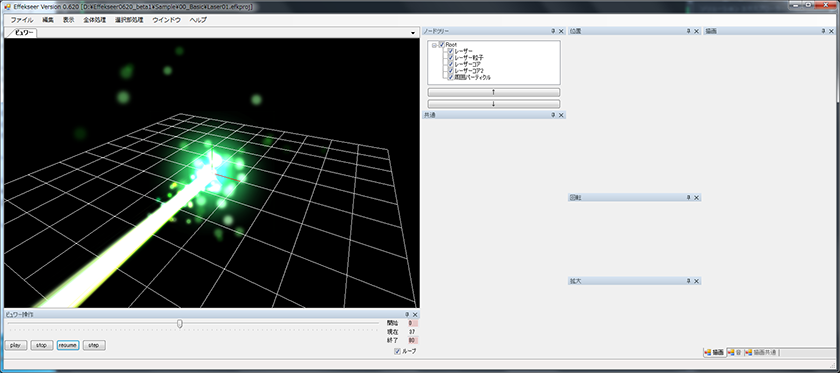

## 22. Tips : エフェクトを導入してみよう

### 概要

いままでは、キャラクターも弾も画像を用いて描画していました。当然、弾を撃った時に発生するエフェクトや弾が命中した時に発生するエフェクトも画像を用いて描画できます。


その画像を複数枚用意することにより、アニメーションも表現できます。ただ、複数枚の画像を用いてエフェクトを表現する場合、画像のサイズが大きくなってしまいます。
それを防ぎ、かつ、効率よくエフェクトを作成するためにAC-EngineではEffekseerというエフェクト編集ツール上で生成されたエフェクトのデータを直接再生できるようになっています。


この、Effekseerというツールは数値と画像を元に様々なエフェクトを作成できます。例えば、ヒットエフェクト、弾から必殺技まで全て作成できます。


本章では、AC-Engine上でEffekseerにより作成されたエフェクトを表示する方法を説明します。

### 事前準備

今回も、自分でプロジェクトの設定せずに、設定済みのプロジェクトをダウンロードして、それを使用します。

なお、今回はTipsにつき、前章までのソースコードとは関連がありません。リソースもプロジェクトに含まれています。

[プロジェクト](Projects/STG22.zip)

[DLL](Common/dll.zip)

### エフェクトの作成

まず、Effekseerの公式サイトからツールをダウンロードしましょう。

このサイトから　Effekseer0.620 (2015/05/23時点での最新版) をダウンロードします。

[Effekseer公式サイト](https://sites.google.com/site/effekseer/)

ダウンロードされたファイルには編集ツールやサンプルが付属しています。
それではダウンロードされたファイルを解凍して、``` Bin/Effekseer.exe ``` を起動します。そして、``` Sample/00_Basic/Laser01.efkproj ``` といったサンプルファイルを開いてみましょう。
開いて再生ボタンを押すと以下のような画面が表示されます。



今回の目的はエフェクトの編集の仕方を教えることではないので、開いているファイルをAC-Engineで読み込める形式に変換します。

``` ファイル->出力->標準形式 ``` の順番にメニューを選択していくと、標準形式(.efk)ファイルを出力できます。
保存するときに倍率を聞かれますが、ここでは1を選択します。

### エフェクトの表示


### まとめ

本章では、エフェクトの表示について学びました。プログラムでなくツールでエフェクトを作成することでプログラマとデザイナーが仕事を分担できるようにもなります。
ただ、格好良くするためにエフェクトを増やすとアプリケーションが重くなる危険性もあるので、そこはプログラマとデザイナー間で話しあいましょう。


